# Pemrograman Mobile

---

Nama : Lintang Aprillya Sari Sari

Kelas : 3C / 13

NIM : 2241720231

---

## Jobsheet 11 : Pemrograman Asynchronous

### Praktikum 1 : Mengunduh Data dari Web Service (API)

    Selesaikan langkah-langkah praktikum berikut ini menggunakan editor Visual Studio Code (VS Code) atau Android Studio atau code editor lain kesukaan Anda. Jawablah di laporan praktikum Anda pada setiap soal yang ada di beberapa langkah praktikum ini.

    Perhatian: Diasumsikan Anda telah berhasil melakukan setup environment Flutter SDK, VS Code, Flutter Plugin, dan Android SDK pada pertemuan pertama.

#### Langkah 1 : Buat Project Baru

Buatlah sebuah project flutter baru dengan nama books di folder src week-12 repository GitHub Anda.

Kemudian Tambahkan dependensi http dengan mengetik perintah berikut di terminal.

Jawab :

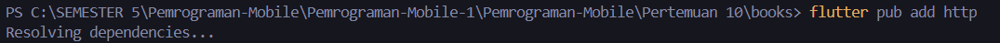

#### Langkah 2 : Cek file pubspec.yaml

Jika berhasil install plugin, pastikan plugin http telah ada di file pubspec ini seperti berikut.

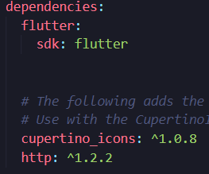

#### Langkah 3 : Buka file main.dart

Ketiklah kode seperti berikut ini.

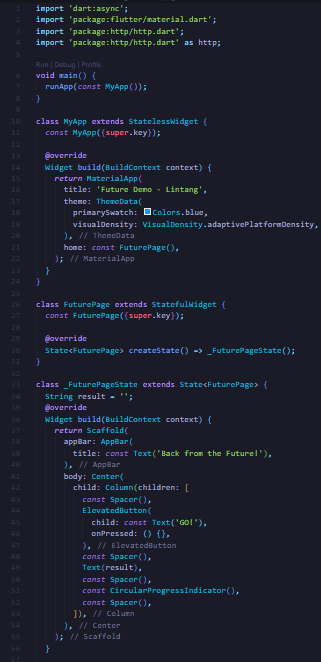

    Catatan:
    Tidak ada yang spesial dengan kode di main.dart tersebut. Perlu diperhatikan di kode tersebut terdapat widget CircularProgressIndicator yang akan menampilkan animasi berputar secara terus-menerus, itu pertanda bagus bahwa aplikasi Anda responsif (tidak freeze/lag). Ketika animasi terlihat berhenti, itu berarti UI menunggu proses lain sampai selesai.

**Soal 1**

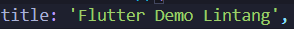

Tambahkan nama panggilan Anda pada title app sebagai identitas hasil pekerjaan Anda.

#### Langkah 4 : Tambah method getData()

Tambahkan method ini ke dalam class \_FuturePageState yang berguna untuk mengambil data dari API Google Books.

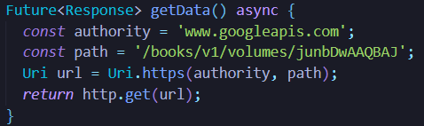

**Soal 2**

- Carilah judul buku favorit Anda di Google Books, lalu ganti ID buku pada variabel path di kode tersebut. Caranya ambil di URL browser Anda seperti gambar berikut ini.

.png>)

- Kemudian cobalah akses di browser URI tersebut dengan lengkap seperti ini. Jika menampilkan data JSON, maka Anda telah berhasil. Lakukan capture milik Anda dan tulis di README pada laporan praktikum. Lalu lakukan commit dengan pesan "W12: Soal 2".

.png>)

#### Langkah 5 : Tambah kode di ElevatedButton

Tambahkan kode pada onPressed di ElevatedButton seperti berikut.

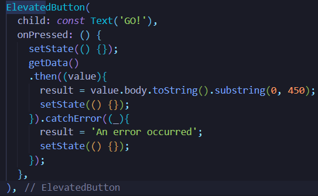

Lakukan run aplikasi Flutter Anda. Anda akan melihat tampilan akhir seperti gambar berikut. Jika masih terdapat error, silakan diperbaiki hingga bisa running.

**Soal 3**

- Jelaskan maksud kode langkah 5 tersebut terkait substring dan catchError!
  Jawab :
  - substring :
    Fungsi dari substring disini adalah untuk membatasi jumlah karakter yang ditampilkan dengan maksimal 450 karakter
  - catchError :
    Fungsi dari catchError disini adalah untuk menemukan error dan menampilkan pesan error 'An error acccured' jika terjadi error
- Capture hasil praktikum Anda berupa GIF dan lampirkan di README. Lalu lakukan commit dengan pesan "W12: Soal 3".

  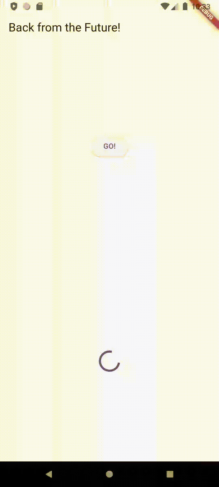

  .png>)

### Praktikum 2 : Menggunakan await/async untuk Menghindari Callbacks

Ada alternatif penggunaan Future yang lebih clean, mudah dibaca dan dirawat, yaitu pola async/await. Intinya pada dua kata kunci ini:

- async digunakan untuk menandai suatu method sebagai asynchronous dan itu harus ditambahkan di depan kode function.
- await digunakan untuk memerintahkan menunggu sampai eksekusi suatu function itu selesai dan mengembalikan sebuah value. Untuk then bisa digunakan pada jenis method apapun, sedangkan await hanya bekerja di dalam method async.

#### Langkah 1 : Buka file main.dart

Tambahkan tiga method berisi kode seperti berikut di dalam class \_FuturePageState.

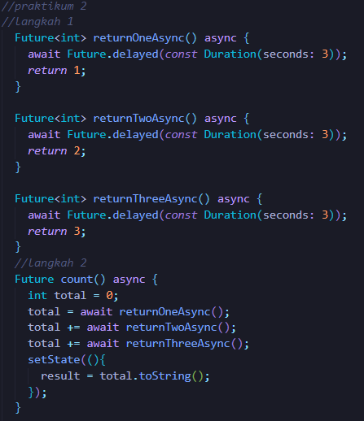

#### Langkah 2 : Tambah method count()

Lalu tambahkan lagi method ini di bawah ketiga method sebelumnya.

#### Langkah 3: Panggil count()

Lakukan comment kode sebelumnya, ubah isi kode onPressed() menjadi seperti berikut.

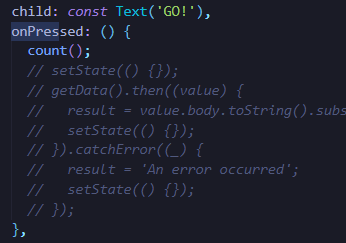

#### Langkah 4: Run

Akhirnya, run atau tekan F5 jika aplikasi belum running. Maka Anda akan melihat seperti gambar berikut, hasil angka 6 akan tampil setelah delay 9 detik.

**Soal 4**

Jelaskan maksud kode langkah 1 dan 2 tersebut!
Capture hasil praktikum Anda berupa GIF dan lampirkan di README. Lalu lakukan commit dengan pesan "W12: Soal 4".

Jawab :

Langkah 1 Kode di atas adalah kode Dart yang terdiri dari tiga fungsi asynchronous, yaitu returnOneAsync(), returnTwoAsync(), dan returnThreeAsync(). Ketiga fungsi ini mengembalikan nilai int dan menggunakan Future.delayed() untuk menunda eksekusi selama 3 detik. Berikut adalah penjelasan masing-masing fungsi:

- returnOneAsync() Fungsi ini mengembalikan nilai 1 setelah 3 detik.
- returnTwoAsync() Fungsi ini mengembalikan nilai 2 setelah 3 detik.
- returnThreeAsync() Fungsi ini mengembalikan nilai 3 setelah 3 detik.

Langkah 2 Kode di atas adalah sebuah fungsi asynchronous bernama count() yang digunakan untuk menghitung jumlah dari tiga fungsi asynchronous lainnya, yaitu returnOneAsync(), returnTwoAsync(), dan returnThreeAsync(). Fungsi count() ini mengembalikan Future, yang berarti bahwa eksekusinya tidak akan memblokir kode lainnya.

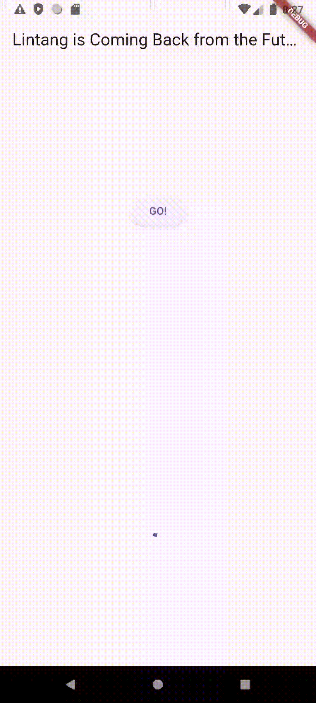

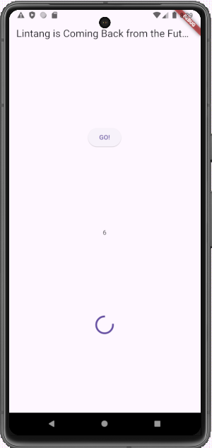

### Praktikum 3 : Menggunakan Completer di Future

#### Langkah 1 : Buka main.dart

Pastikan telah impor package async berikut.

import 'package:async/async.dart';

#### Langkah 2 : Tambahkan variabel dan method

Tambahkan variabel late dan method di class \_FuturePageState seperti ini.

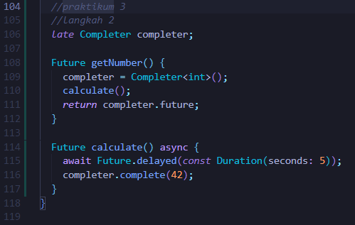

#### Langkah 3 : Ganti isi kode onPressed()

Tambahkan kode berikut pada fungsi onPressed(). Kode sebelumnya bisa Anda comment.
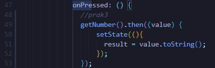

#### Langkah 4 :

Terakhir, run atau tekan F5 untuk melihat hasilnya jika memang belum running. Bisa juga lakukan hot restart jika aplikasi sudah running. Maka hasilnya akan seperti gambar berikut ini. Setelah 5 detik, maka angka 42 akan tampil.

**Soal 5**

Jelaskan maksud kode langkah 2 tersebut!
Capture hasil praktikum Anda berupa GIF dan lampirkan di README. Lalu lakukan commit dengan pesan "W12: Soal 5".

Jawab :

- Variabel completer Variabel completer adalah variabel late dari tipe Completer. Variabel ini digunakan untuk menyimpan hasil dari perhitungan angka 42.
- Method getNumber() Method getNumber() mengembalikan nilai dari variabel completer. Method ini memiliki dua langkah: a. Inisialisasi variabel completer dengan nilai baru. b. Memanggil method calculate() untuk menghitung angka 42.
- Method calculate() Method calculate() menggunakan Future.delayed() untuk menunggu 5 detik sebelum menyelesaikan perhitungan angka 42. Setelah 5 detik, method ini akan memanggil method completer.complete() untuk menyelesaikan perhitungan dan mengembalikan nilai 42 ke variabel completer

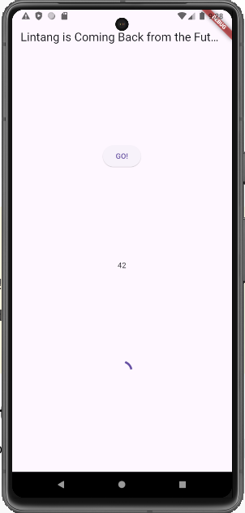

#### Langkah 5 : Ganti method calculate()

Gantilah isi code method calculate() seperti kode berikut, atau Anda dapat membuat calculate2()

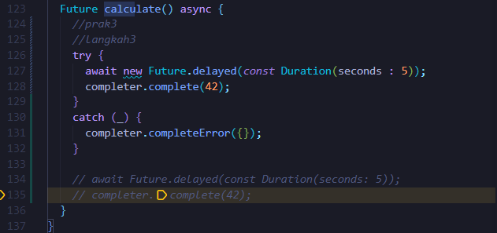

#### Langkah 6 : Pindah ke onPressed()

Ganti menjadi kode seperti berikut.

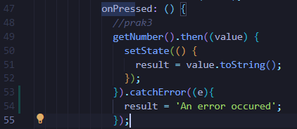

**Soal 6**

Jelaskan maksud perbedaan kode langkah 2 dengan langkah 5-6 tersebut!
Capture hasil praktikum Anda berupa GIF dan lampirkan di README. Lalu lakukan commit dengan pesan "W12: Soal 6".

Jawab :

Langkah 5
Pada langkah 5, kita mengganti isi dari method calculate(). Method calculate() sebelumnya menggunakan await Future.delayed(const Duration(seconds: 5)); untuk menunggu 5 detik sebelum menyelesaikan perhitungan angka 42. Namun, method ini tidak menangani kesalahan yang mungkin terjadi saat menunggu 5 detik.

Langkah 6
Kode ini menggunakan then() dan catchError() untuk menangani hasil dari method getNumber(). Jika tidak terjadi kesalahan, maka method ini akan memanggil method setState() untuk memperbarui state dari widget. Jika terjadi kesalahan, maka method ini akan memanggil method setState() untuk memperbarui state dari widget dan menampilkan pesan kesalahan.

Capture hasil praktikum Anda berupa GIF dan lampirkan di README. Lalu lakukan commit dengan pesan "W12: Soal 6".

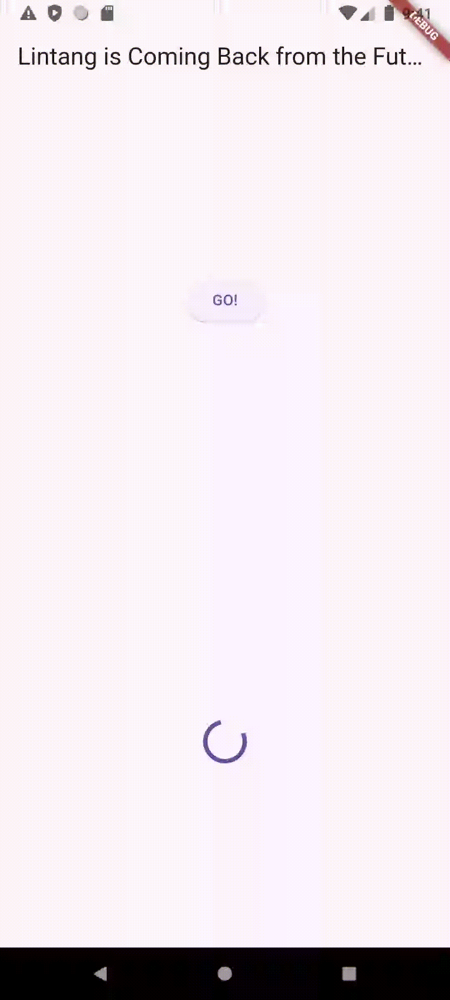

### Praktikum 4 : Memanggil Future secara Paralel

#### Langkah 1 : Buka file main.dart

Tambahkan method ini ke dalam class \

#### Langkah 2 : Edit onPressed()

Anda bisa hapus atau comment kode sebelumnya, kemudian panggil method dari langkah 1 tersebut.

#### Langkah 3 : Run

Anda akan melihat hasilnya dalam 3 detik berupa angka 6 lebih cepat dibandingkan praktikum sebelumnya menunggu sampai 9 detik.

**Soal 7**

Capture hasil praktikum Anda berupa GIF dan lampirkan di README. Lalu lakukan commit dengan pesan "W12: Soal 7".

#### Langkah 4 : Ganti variabel futureGroup

Anda dapat menggunakan FutureGroup dengan Future.wait seperti kode berikut.

**Soal 8**
Jelaskan maksud perbedaan kode langkah 1 dan 4!

### Praktikum 5 : Menangani Respon Error pada Async Code

#### Langkah 1 : Buka file main.dart

Tambahkan method ini ke dalam class \_FuturePageState

#### Langkah 2 : ElevatedButton

Ganti dengan kode berikut

#### Langkah 3 : Run

Lakukan run dan klik tombol GO! maka akan menghasilkan seperti gambar berikut.

Pada bagian debug console akan melihat teks Complete seperti berikut.

**Soal 9**

Capture hasil praktikum Anda berupa GIF dan lampirkan di README. Lalu lakukan commit dengan pesan "W12: Soal 9".

#### Langkah 4 : Tambah method handleError()

Tambahkan kode ini di dalam class \_FutureStatePage

**Soal 10**

Panggil method handleError() tersebut di ElevatedButton, lalu run. Apa hasilnya? Jelaskan perbedaan kode langkah 1 dan 4!

### Praktikum 6 : Menggunakan Future dengan StatefulWidget

#### Langkah 1 : install plugin geolocator

Tambahkan plugin geolocator dengan mengetik perintah berikut di terminal.

#### Langkah 2 : Tambah permission GPS

Jika Anda menargetkan untuk platform Android, maka tambahkan baris kode berikut di file android/app/src/main/androidmanifest.xml

#### Langkah 3 : Buat file geolocation.dart

Tambahkan file baru ini di folder lib project Anda.

#### Langkah 4 : Buat StatefulWidget

Buat class LocationScreen di dalam file geolocation.dart

#### Langkah 5 : Isi kode geolocation.dart

**Soal 11**

Tambahkan nama panggilan Anda pada tiap properti title sebagai identitas pekerjaan Anda.

#### Langkah 6 : Edit main.dart

Panggil screen baru tersebut di file main Anda seperti berikut.

#### Langkah 7 : Run

Run project Anda di device atau emulator (bukan browser), maka akan tampil seperti berikut ini.

#### Langkah 8 : Tambahkan animasi loading

Tambahkan widget loading seperti kode berikut. Lalu hot restart, perhatikan perubahannya.

**Soal 12**

- Jika Anda tidak melihat animasi loading tampil, kemungkinan itu berjalan sangat cepat. Tambahkan delay pada method getPosition() dengan kode await Future.delayed(const Duration(seconds: 3));
- Apakah Anda mendapatkan koordinat GPS ketika run di browser? Mengapa demikian?
- Capture hasil praktikum Anda berupa GIF dan lampirkan di README. Lalu lakukan commit dengan pesan "W12: Soal 12".

### Praktikum 7 : Manajemen Future dengan FutureBuilder

#### Langkah 1 : Modifikasi method getPosition()

Buka file geolocation.dart kemudian ganti isi method dengan kode ini.

#### Langkah 2 : Tambah variabel

Tambah variabel ini di class \_LocationScreenState

#### Langkah 3 : Tambah initState()

Tambah method ini dan set variabel position

#### Langkah 4 : Edit method build()

Ketik kode berikut dan sesuaikan. Kode lama bisa Anda comment atau hapus.

**Soal 13**

- Apakah ada perbedaan UI dengan praktikum sebelumnya? Mengapa demikian?
- Capture hasil praktikum Anda berupa GIF dan lampirkan di README. Lalu lakukan commit dengan pesan "W12: Soal 13".
- Seperti yang Anda lihat, menggunakan FutureBuilder lebih efisien, clean, dan reactive dengan Future bersama UI.

#### Langkah 5 : Tambah handling error

Tambahkan kode berikut untuk menangani ketika terjadi error. Kemudian hot restart.

**Soal 14**

- Apakah ada perbedaan UI dengan langkah sebelumnya? Mengapa demikian?
- Capture hasil praktikum Anda berupa GIF dan lampirkan di README. Lalu lakukan commit dengan pesan "W12: Soal 14".

### Praktikum 8 : Navigation Route dengan Future Function

#### Langkah 1 : Buat file baru navigation_first.dart

Buatlah file baru ini di project lib Anda.

#### Langkah 2 : Isi kode navigation_first.dart

**Soal 15**

- Tambahkan nama panggilan Anda pada tiap properti title sebagai identitas pekerjaan Anda.
- Silakan ganti dengan warna tema favorit Anda.

#### Langkah 3 : Tambah method di class \_NavigationFirstState

Tambahkan method ini.

#### Langkah 4 : Buat file baru navigation_second.dart

Buat file baru ini di project lib Anda. Silakan jika ingin mengelompokkan view menjadi satu folder dan sesuaikan impor yang dibutuhkan.

#### Langkah 5 : Buat class NavigationSecond dengan StatefulWidget

#### Langkah 6 : Edit main.dart

Lakukan edit properti home.

#### Langkah 8: Run

Lakukan run, jika terjadi error silakan diperbaiki.

**Soal 16**

- Cobalah klik setiap button, apa yang terjadi ? Mengapa demikian ?
- Gantilah 3 warna pada langkah 5 dengan warna favorit Anda!
- Capture hasil praktikum Anda berupa GIF dan lampirkan di README. Lalu lakukan commit dengan pesan "W12: Soal 16".

Hasilnya akan seperti gambar berikut ini.

### Praktikum 9 : Memanfaatkan async/await dengan Widget Dialog

#### Langkah 1 : Buat file baru navigation_dialog.dart

Buat file dart baru di folder lib project Anda.

#### Langkah 2 : Isi kode navigation_dialog.dart

#### Langkah 3 : Tambah method async

#### Langkah 4 : Panggil method di ElevatedButton

#### Langkah 5 : Edit main.dart

Ubah properti home

#### Langkah 6 : Run

Coba ganti warna background dengan widget dialog tersebut. Jika terjadi error, silakan diperbaiki. Jika berhasil, akan tampil seperti gambar berikut.

**Soal 17**

- Cobalah klik setiap button, apa yang terjadi ? Mengapa demikian ?
- Gantilah 3 warna pada langkah 3 dengan warna favorit Anda!
- Capture hasil praktikum Anda berupa GIF dan lampirkan di README. Lalu lakukan commit dengan pesan "W12: Soal 17".
