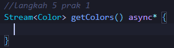

# Pemrograman Mobile

---

Nama : Lintang Aprillya Sari Sari

Kelas : 3C / 13

NIM : 2241720231

---

## Jobsheet 12 : Streams

### Praktikum 1 : Dart Streams

Selesaikan langkah-langkah praktikum berikut ini menggunakan editor Visual Studio Code (VS Code) atau Android Studio atau code editor lain kesukaan Anda. Jawablah di laporan praktikum Anda (ketik di README.md) pada setiap soal yang ada di beberapa langkah praktikum ini.

#### > Langkah 1 : Buat Project Baru

Buatlah sebuah project flutter baru dengan nama stream_nama (beri nama panggilan Anda) di folder week-13/src/ repository GitHub Anda.

#### > Langkah 2 : Buka file main.dart

Ketiklah kode seperti berikut ini.

**Soal 1**

- Tambahkan nama panggilan Anda pada title app sebagai identitas hasil pekerjaan Anda.
- Gantilah warna tema aplikasi sesuai kesukaan Anda.
- Lakukan commit hasil jawaban Soal 1 dengan pesan "W13: Jawaban Soal 1"

#### > Langkah 3 : Buat file baru stream.dart

Buat file baru di folder lib project Anda. Lalu isi dengan kode berikut.

#### > Langkah 4 : Tambah variabel colors

Tambahkan variabel di dalam class ColorStream seperti berikut.

**Soal 2**

- Tambahkan 5 warna lainnya sesuai keinginan Anda pada variabel colors tersebut.
- Lakukan commit hasil jawaban Soal 2 dengan pesan "W13: Jawaban Soal 2"

#### > Langkah 5 : Tambah method getColors()

Di dalam class ColorStream ketik method seperti kode berikut. Perhatikan tanda bintang di akhir keyword async\* (ini digunakan untuk melakukan Stream data)

#### > Langkah 6 : Tambah perintah yield\*

Tambahkan kode berikut ini.

**Soal 3**

- Jelaskan fungsi keyword yield\* pada kode tersebut!

  jawab :

  - yield\* digunakan untuk mendistribusikan elemen-elemen dari sebuah Stream atau Iterable ke stream yang sedang dibangun oleh fungsi generator async.
  - Dalam kode tersebut, yield\* mengambil nilai dari Stream.periodic dan meneruskannya ke output stream getColors().
  - Fungsinya serupa dengan yield tetapi lebih efisien jika perlu menghasilkan seluruh elemen dari sebuah iterable atau stream lain.

- Apa maksud isi perintah kode tersebut?

  jawab :

  - Stream.periodic:

    Membuat stream yang menghasilkan nilai secara berkala (dalam hal ini setiap 1 detik).

  - t % colors.length:

    Menghitung indeks warna secara melingkar berdasarkan panjang array colors. Indeks ini digunakan untuk memastikan bahwa iterasi tetap dalam batas panjang array.

  - Return Value:
    Stream akan menghasilkan warna dari daftar colors sesuai dengan indeks yang dihitung setiap detik.

  Secara keseluruhan: Kode ini menciptakan stream yang mengalirkan warna secara bergantian dari array colors setiap detik.

- Lakukan commit hasil jawaban Soal 3 dengan pesan "W13: Jawaban Soal 3"

#### > Langkah 7 : Buka main.dart

Ketik kode impor file ini pada file main.dart

    import 'stream.dart';

#### > Langkah 8 : Tambah variabel

Ketik dua properti ini di dalam class \_StreamHomePageState

    Color bgColor = Colors.blueGrey;
    late ColorStream colorStream;

#### > Langkah 9 : Tambah method changeColor()

Tetap di file main, Ketik kode seperti berikut

#### > Langkah 10 : Lakukan override initState()

Ketika kode seperti berikut

#### > Langkah 11 : Ubah isi Scaffold()

Sesuaikan kode seperti berikut.

#### > Langkah 12 : Run

Lakukan running pada aplikasi Flutter Anda, maka akan terlihat berubah warna background setiap detik.
**Soal 4**

- Capture hasil praktikum Anda berupa GIF dan lampirkan di README.
- Lakukan commit hasil jawaban Soal 4 dengan pesan "W13: Jawaban Soal 4"

  

#### > Langkah 13: Ganti isi method changeColor()

Anda boleh comment atau hapus kode sebelumnya, lalu ketika kode seperti berikut.
**Soal 5**

- Jelaskan perbedaan menggunakan listen dan await for (langkah 9) !

Jawab :

    - listen: Digunakan untuk mendengarkan stream secara reaktif. Data diterima setiap kali stream memancarkan nilai baru, dan callback dijalankan untuk setiap nilai yang diterima. Ini lebih cocok untuk aplikasi yang mengharuskan UI diperbarui secara langsung.
    - await for: Digunakan untuk menunggu setiap nilai dari stream secara berurutan dalam operasi asynchronous. Digunakan dalam konteks di mana Anda ingin memproses stream secara lebih terkontrol atau satu per satu dengan blok kode yang menunggu setiap nilai.

- Lakukan commit hasil jawaban Soal 5 dengan pesan "W13: Jawaban Soal 5"

  Catatan: Stream di Flutter memiliki fitur yang powerfull untuk menangani data secara async. Stream dapat dimanfaatkan pada skenario dunia nyata seperti real-time messaging, unggah dan unduh file, tracking lokasi user, bekerja dengan data sensor IoT, dan lain sebagainya.

### Praktikum 2 : Stream Controllers dan Sinks

#### > Langkah 1 : Buka file stream.dart

Lakukan impor dengan mengetik kode ini.

import 'dart:async';

#### > Langkah 2 : Tambah class NumberStream

Tetap di file stream.dart tambah class baru seperti berikut.

#### > Langkah 3 : Tambah StreamController

Di dalam class NumberStream buatlah variabel seperti berikut.

#### > Langkah 4 : Tambah method addNumberToSink

Tetap di class NumberStream buatlah method ini

#### > Langkah 5 : Tambah method close()

#### > Langkah 6 : Buka main.dart

Ketik kode import seperti berikut

#### > Langkah 7 : Tambah variabel

Di dalam class \_StreamHomePageState ketik variabel berikut

#### > Langkah 8 : Edit initState()

#### > Langkah 9 : Edit dispose()

#### > Langkah 10 : Tambah method addRandomNumber()

#### > Langkah 11 : Edit method build()

#### > Langkah 12 : Run

Lakukan running pada aplikasi Flutter Anda, maka akan terlihat seperti gambar berikut.

**Soal 6**

- Jelaskan maksud kode langkah 8 dan 10 tersebut!

Jawab :

    - Langkah 8: Pada kode ini, variabel bgColor digunakan untuk menyimpan warna latar belakang yang akan diperbarui secara dinamis, dan colorStream adalah objek dari kelas ColorStream yang berfungsi untuk mengelola stream warna.

    - Langkah 10: initState() adalah metode yang dipanggil saat state widget pertama kali dibuat. Di sini, colorStream diinisialisasi dan changeColor() dipanggil untuk mulai mendengarkan stream warna dan memperbarui tampilan.

- Capture hasil praktikum Anda berupa GIF dan lampirkan di README.

- Lalu lakukan commit dengan pesan "W13: Jawaban Soal 6".

#### Langkah 13 : Buka stream.dart

Tambahkan method berikut ini.

    addError() {
        controller.sink.addError('Error');
    }

#### > Langkah 14 : Buka main.dart

Tambahkan method onError di dalam class StreamHomePageState pada method listen di fungsi initState() seperti berikut ini.

#### > Langkah 15 : Edit method addRandomNumber()

Lakukan comment pada dua baris kode berikut, lalu ketik kode seperti berikut ini.

numberStream.addError();

**Soal 7**

- Jelaskan maksud kode langkah 13 sampai 15 tersebut!

Jawab :

    - Pada langkah 13, kita menambahkan method addError() ke kelas Stream. Method ini digunakan untuk menambahkan error ke stream.
    - Pada langkah 15, kita mengedit method addRandomNumber(). Kita mengomentari dua baris kode yang sebelumnya digunakan untuk menambahkan random number ke stream. Kemudian, kita menambahkan kode baru untuk menambahkan error ke stream.

- Kembalikan kode seperti semula pada Langkah 15, comment addError() agar Anda dapat melanjutkan ke praktikum 3 berikutnya.
- Lalu lakukan commit dengan pesan "W13: Jawaban Soal 7".

### Praktikum 3 : Injeksi Data e Streams

#### > Langkah 1 : Buka main.dart

Tambahkan variabel baru di dalam class \_StreamHomePageState

         late StreamTransformer transformer;

#### > Langkah 2 : Tambahkan kode ini di initState

        transformer = StreamTransformer<int, int>.fromHandlers(
        handleData: (value, sink) {
            sink.add(value * 10); // Perbaiki penulisan, seharusnya value * 10
        },
        handleError: (error, trace, sink) {
            sink.add(-1);
        },
        handleDone: (sink) {
            sink.close();
        },
        );

#### > Langkah 3 : Tetap di initState

Lakukan edit seperti kode berikut.

#### > Langkah 4 : Run

Terakhir, run atau tekan F5 untuk melihat hasilnya jika memang belum running. Bisa juga lakukan hot restart jika aplikasi sudah running. Maka hasilnya akan seperti gambar berikut ini. Anda akan melihat tampilan angka dari 0 hingga 90.

**Soal 8**

- Jelaskan maksud kode langkah 1-3 tersebut!

Jawab :

    - Langkah 1 : Pada langkah ini, kita menambahkan variabel baru bernama transformer di dalam class _StreamHomePageState. Variabel ini akan digunakan untuk menyimpan objek StreamTransformer.

    - Langkah 2: Pada langkah ini, kita menambahkan kode untuk membuat objek StreamTransformer. Objek ini akan digunakan untuk mengubah data yang diterima dari stream. Dalam kasus ini, kita akan mengubah data integer menjadi integer yang dikalikan dengan 10.

    - Langkah 3: Pada langkah ini, kita melakukan edit kode di initState(). Kita menambahkan kode untuk menggunakan objek transformer untuk mengubah data yang diterima dari stream.

- Capture hasil praktikum Anda berupa GIF dan lampirkan di README.

- Lalu lakukan commit dengan pesan "W13: Jawaban Soal 8".

### Praktikum 4 : Subscribe ke Stream Events

#### > Langkah 1 : Tambah variabel

Tambahkan variabel berikut di class \_StreamHomePageState

#### > Langkah 2 : Edit initState()

Edit kode seperti berikut ini.

#### > Langkah 3 : Tetap di initState()

Tambahkan kode berikut ini.

#### > Langkah 4 : Tambah properti onDone()

Tambahkan dibawahnya kode ini setelah onError

#### > Langkah 5 : Tambah method baru

Ketik method ini di dalam class \_StreamHomePageState

#### > Langkah 6 : Pindah ke method dispose()

Jika method dispose() belum ada, Anda dapat mengetiknya dan dibuat override. Ketik kode ini didalamnya.

    subscription.cancel();

#### > Langkah 7 : Pindah ke method build()

Tambahkan button kedua dengan isi kode seperti berikut ini.

#### > Langkah 8 : Edit method addRandomNumber()

Edit kode seperti berikut ini.

        void addRandomNumber() {
            Random random = Random();
            int myNum = random.nextInt(10);
            // numberStream.addNumberToSink(myNum); // Add random number to stream
            if (!numberStreamController.isClosed) {
            numberStream.addNumberToSink(myNum);
            }
            else {
            setState(() {
                lastNumber = -1;
            });
            }
        }

#### > Langkah 9 : Run

Anda akan melihat dua button seperti gambar berikut.

#### > Langkah 10 : Tekan button ‘Stop Subscription'

Anda akan melihat pesan di Debug Console seperti berikut.

**Soal 9**

- Jelaskan maksud kode langkah 2, 6 dan 8 tersebut!

Jawab :

    - Langkah 2 : Pada langkah ini, kita menambahkan kode untuk membuat objek NumberStream dan NumberStreamController. Objek NumberStream akan digunakan untuk menghasilkan stream integer secara acak. Objek NumberStreamController akan digunakan untuk mengontrol stream tersebut.

    - Langkah 6 : Pada langkah ini, kita menambahkan kode untuk membatalkan subscription di dispose(). Subscription ini harus dibatalkan untuk mencegah memory leak.

    - Langkah 8 : Pada langkah ini, kita menambahkan kode untuk memeriksa apakah stream telah ditutup sebelum menambahkan data ke stream. Jika stream telah ditutup, kita akan mengubah nilai variabel lastNumber dengan nilai -1.

- Capture hasil praktikum Anda berupa GIF dan lampirkan di README.

- Lalu lakukan commit dengan pesan "W13: Jawaban Soal 9".

### Praktikum 5 : Multiple Stream Subscriptions

#### > Langkah 1 : Buka file main.dart

Ketik variabel berikut di class \_StreamHomePageState

#### > Langkah 2 : Edit initState()

Ketik kode seperti berikut.

#### > Langkah 3 : Run

Lakukan run maka akan tampil error seperti gambar berikut.

**Soal 10**

- Jelaskan mengapa error itu bisa terjadi ?

Kesalahan tersebut terjadi ketika mencoba untuk menambahkan atau membuat dua langganan pada stream yang sama, tanpa membatalkan langganan sebelumnya. Hal tersebut terjadi ketika inisialisasi langganan2 pada metode initState() karena sudah ada inisialisasi langganan untuk menangani stream yang sama pada satu waktu.

#### > Langkah 4 : Set broadcast stream

Ketik kode seperti berikut di method initState()

#### > Langkah 5 : Edit method build()

Tambahkan text seperti berikut

#### > Langkah 6 : Run

Tekan button ‘New Random Number' beberapa kali, maka akan tampil teks angka terus bertambah sebanyak dua kali.

**Soal 11**

- Jelaskan mengapa hal itu bisa terjadi ?

Jawab :

Saat tombol "New Random Number" ditekan, maka akan menghasilkan dua angka random yang sama. Angka-angka tersebut merupakan output dari stream yang dipanggil oleh objek subscription dan subscription2. Stream tersebut akan mengembalikan nilai berupa event (angka random) yang dipisahkan dengan tanda "-". Saat tombol "Stop Stream" ditekan, maka akan menghentikan langganan terhadap stream. Hal ini menyebabkan stream tidak lagi bisa mengeluarkan output, meskipun tombol "New Random Number" ditekan.

- Capture hasil praktikum Anda berupa GIF dan lampirkan di README.

- Lalu lakukan commit dengan pesan "W13: Jawaban Soal 10,11".

### Praktikum 6 : StreamBuilder

#### > Langkah 1 : Buat Project Baru

Buatlah sebuah project flutter baru dengan nama streambuilder_nama (beri nama panggilan Anda) di folder week-13/src/ repository GitHub Anda.

#### > Langkah 2 : Buat file baru stream.dart

Ketik kode ini

#### > Langkah 3 : Tetap di file stream.dart

Ketik kode seperti berikut.

#### > Langkah 4 : Edit main.dart

Ketik kode seperti berikut ini.

#### > Langkah 5 : Tambah variabel

Di dalam class \_StreamHomePageState, ketika variabel ini.

#### > Langkah 6 : Edit initState()

Ketik kode seperti berikut.

#### > Langkah 7 : Edit method build()

#### > Langkah 8 : Run

Hasilnya, setiap detik akan tampil angka baru seperti berikut.

**Soal 12**

- Jelaskan maksud kode pada langkah 3 dan 7 !

Jawab :

    - Langkah 3 melibatkan pembuatan class NumberStream(), yang mencakup metode getNumbers() untuk menghasilkan stream yang berisi angka-angka acak. Stream ini diperbarui setiap 1 detik.
    - Sementara itu, Langkah 7 menunjukkan penggunaan kode untuk membuat antarmuka pengguna (UI) yang dapat menampilkan nilai dari stream secara real-time. Untuk mencapai ini, digunakan StreamBuilder, yang secara otomatis memperbarui antarmuka setiap kali ada perubahan dalam stream. Perubahan ini dapat berupa perubahan nilai atau munculnya error. Dalam kasus terjadinya error, pesan 'Error!' akan ditampilkan. Jika tidak ada error dan data diterima dari stream, angka acak akan ditampilkan dengan ukuran font setara dengan 96. Namun, jika tidak ada data yang diterima, antarmuka akan menampilkan widget kosong.

- Capture hasil praktikum Anda berupa GIF dan lampirkan di README.

- Lalu lakukan commit dengan pesan "W13: Jawaban Soal 12".

### Praktikum 7 : BLoC Pattern

#### > Langkah 1 : Buat Project baru

Buatlah sebuah project flutter baru dengan nama bloc_random_nama (beri nama panggilan Anda) di folder week-13/src/ repository GitHub Anda. Lalu buat file baru di folder lib dengan nama random_bloc.dart

#### > Langkah 2 : Isi kode random_bloc.dart

Ketik kode impor berikut ini.

#### > Langkah 3 : Buat class RandomNumberBloc()

#### > Langkah 4 : Buat variabel StreamController

Di dalam class RandomNumberBloc() ketik variabel berikut ini

#### > Langkah 5 : Buat constructor

#### > Langkah 6 : Buat method dispose()

#### > Langkah 7 : Edit main.dart

#### > Langkah 8 : Buat file baru random_screen.dart

Di dalam folder lib project Anda, buatlah file baru ini.

#### > Langkah 9 : Lakukan impor material dan random_bloc.dart

Ketik kode ini di file baru random_screen.dart

#### > Langkah 10 : Buat StatefulWidget RandomScreen

Buatlah di dalam file random_screen.dart

#### > Langkah 11: Buat variabel

Ketik kode ini di dalam class \_RandomScreenState

#### > Langkah 12 : Buat method dispose()

Ketik kode ini di dalam class \_StreamHomePageState

#### > Langkah 13 : Edit method build()

Ketik kode ini di dalam class \_StreamHomePageState

Run aplikasi, maka Anda akan melihat angka acak antara angka 0 sampai 9 setiap kali menekan tombol FloactingActionButton.

**Soal 13**

- Jelaskan maksud praktikum ini ! Dimanakah letak konsep pola BLoC-nya ?
- Capture hasil praktikum Anda berupa GIF dan lampirkan di README.
- Lalu lakukan commit dengan pesan "W13: Jawaban Soal 13".
