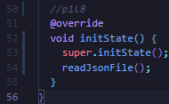
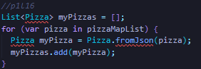

# Pemrograman Mobile

---

Nama : Lintang Aprillya Sari Sari

Kelas : 3C / 13

NIM : 2241720231

---

## Jobsheet 13 : Persistensi Data

### Praktikum 1 : Converting Dart models into JSON

#### > 1. Di editor favorit Anda, buat proyek Flutter baru dan beri nama store_data

#### > 2. Pada file main.dart, hapus kode yang ada dan tambahkan kode awal untuk aplikasi dengan kode berikut:

#### > 3. Tambahkan folder baru ke root proyek Anda dengan nama assets.

#### > 4. Di dalam folder aset, buat file baru bernama pizzalist.json dan salin konten yang tersedia di tautan https://gist.github.com/simoales/a33c1c2abe78b48a75ccfd5fa0de0620 File ini berisi daftar objek JSON.

#### > 5. Di file pubspec.yaml, tambahkan referensi ke folder aset baru, seperti yang ditunjukkan di sini:

#### > 6. Pada kelas \_MyHomePageState, di main.dart, tambahkan sebuah variabel state bernama pizzaString:

#### > 7. Untuk membaca isi file pizzalist.json, di bagian bawah kelas \_MyHomePageState di main.dart, tambahkan metode asinkron baru yang disebut readJsonFile, yang akan mengatur nilai pizzaString, seperti yang ditunjukkan di sini:

#### > 8. Pada kelas \_MyHomePageState, timpa metode initState dan, di dalamnya, panggil metode readJsonFile:

#### > 9. Sekarang, kita ingin menampilkan JSON yang diambil di properti dalam Scaffold. Untuk melakukannya, tambahkan widget Teks sebagai child dari Container kita:

#### > 10. Mari kita jalankan aplikasinya. Jika semuanya berjalan seperti yang diharapkan, Anda akan melihat konten file JSON di layar

#### > 11. Kita ingin mengubah String ini menjadi sebuah List of Objects. Kita akan mulai dengan membuat kelas baru. Dalam folder lib aplikasi kita, buat file baru bernama pizza.dart.

#### > 12. Di dalam file tersebut, tentukan properti kelas Pizza:

#### > 13. Di dalam kelas Pizza, tentukan konstruktor bernama fromJson, yang akan mengambil sebuah Map sebagai parameter dan mengubah Map menjadi sebuah instance dari Pizza:

#### > 14. Refaktor metode readJsonFile() pada kelas \_MyHomePageState. Langkah pertama adalah mengubah String menjadi Map dengan memanggil metode jsonDecode. Pada method readJsonFile, tambahkan kode yang di cetak tebal berikut ini:

#### > 15. Pastikan editor Anda secara otomatis menambahkan pernyataan impor untuk pustaka "dart:convert" di bagian atas file main.dart; jika tidak, tambahkan saja secara manual. Tambahkan juga pernyataan impor untuk kelas pizza:

#### > 16. Langkah terakhir adalah mengonversi string JSON kita menjadi List of native Dart objects. Kita dapat melakukan ini dengan mengulang pizzaMapList dan mengubahnya menjadi objek Pizza. Di dalam metode readJsonFile, di bawah metode jsonDecode, tambahkan kode berikut:

#### > 17. Hapus atau beri komentar pada metode setState yang mengatur String pizzaString dan kembalikan daftar objek Pizza sebagai gantinya:

#### > 18. Ubah signature metode sehingga Anda dapat menampilkan nilai balik secara eksplisit:

#### > 19. Sekarang kita memiliki objek List of Pizza. Daripada hanya menampilkan sebuah Teks kepada pengguna, kita dapat menampilkan sebuah ListView yang berisi sekumpulan widget ListTile. Di bagian atas kelas \_MyHomePageState, buat List<Pizza> bernama myPizzas:

#### > 20. Dalam metode initState, pastikan Anda mengatur myPizzas dengan hasil panggilan ke readJsonFile:

#### > 21. Tambahkan kode berikut ini di dalam Scaffold, di dalam metode build():

#### > 22. Jalankan aplikasi. Antarmuka pengguna sekarang seharusnya jauh lebih ramah dan terlihat seperti yang ditunjukkan pada

### Praktikum 2 : Reading the JSON file

#### > 1. Tambahkan metode baru ke kelas Pizza, di file pizza.dart, yang disebut toJson. Ini akan mengembalikan sebuah Map<String, dynamic> dari objek:

#### > 2. Setelah Anda memiliki sebuah Map, Anda dapat menserialisasikannya kembali ke dalam string JSON. Tambahkan metode baru di di bagian bawah kelas \_MyHomePageState, di dalam file main.dart, yang disebut convertToJSON:

#### > 3. Metode ini mengubah objek List of Pizza kembali menjadi string Json dengan memanggil metode jsonEncode lagi di pustaka dart_convert.

#### > 4. Terakhir, mari panggil metode tersebut dan cetak string JSON di Debug Console. Tambahkan kode berikut ke metode readJsonFile, tepat sebelum mengembalikan List myPizzas:

#### > 5. Jalankan aplikasi. Anda akan melihat string JSON dicetak, seperti yang ditunjukkan pada gambar berikut:

### Praktikum 3 : Saving data simply with SharedPreferences

#### > 1. Gunakan project pada pertemuan 11 bernama books. Pertama, tambahkan ketergantungan pada shared_preferences. Dari Terminal Anda, ketikkan perintah berikut

#### > 2. Untuk memperbarui dependensi dalam proyek Anda, jalankan perintah flutter pub get dari jendela Terminal.

#### > 3. Di bagian atas file main.dart, impor shared_preferences:

#### > 4. Di bagian atas kelas \_MyHomePageState, buat variabel status integer baru bernama appCounter:

#### > 5. Dalam kelas \_MyHomePageState, buat metode asinkron baru yang disebut readAndWritePreferences():

#### > 6. Di dalam metode readAndWritePreference, buatlah sebuah instance dari SharedPreferences:

#### > 7. Setelah membuat instance preferensi, kita membuat kode yang mencoba baca nilai kunci appCounter. Jika nilainya nol, setel ke 0; lalu naikkan nilainya:

#### > 8. Setelah itu, atur nilai kunci appCounter di preferensi ke nilai baru:

#### > 9. Memperbarui nilai status appCounter:

#### > 10. Pada metode initState di kelas \_MyHomePageState, panggil metode readAndWritePreference() dengan kode yang dicetak tebal:

#### > 11. Dalam metode build, tambahkan kode berikut ini di dalam widget Container:

#### > 12. Jalankan aplikasi. Saat pertama kali membukanya, Anda akan melihat layar yang mirip dengan yang berikut ini:

#### > 13. Tambahkan metode baru ke kelas \_MyHomePageState yang disebut deletePreference(), yang akan menghapus nilai yang disimpan:

#### > 14. Dari properti onPressed dari widget ElevatedButton di metode build(), memanggil metode deletePreference(), dengan kode di cetak tebal:

#### > 15. Jalankan aplikasi lagi. Sekarang, saat Anda menekan tombol Reset penghitung, nilai appCounter akan dihapus

### Praktikum 4 : Accessing the filesystem, part 1 : path_provider

Buatlah project flutter baru dengan nama path_provider

#### > 1. menambahkan dependency yang relevan ke file pubspec.yaml. Tambahkan path_provider dengan mengetikkan perintah ini dari Terminal Anda:

#### > 2. Di bagian atas file main.dart, tambahkan impor path_provider:

#### > 3. Di bagian atas kelas \_MyHomePageState, tambahkan variabel State yang akan kita gunakan untuk memperbarui antarmuka pengguna:

#### > 4. Masih dalam kelas \_MyHomePageState, tambahkan metode untuk mengambil direktori temporary dan dokumen:

#### > 5. Pada metode initState dari kelas \_MyHomePageState, panggil metode getPaths:

#### > 6. Pada metode build \_MyHomePageState, buat UI dengan dua widget Teks yang menunjukkan path yang diambil:

#### > 7. Jalankan aplikasi. Anda akan melihat layar yang terlihat seperti berikut ini:

### Praktikum 5: Accessing the filesystem, part 2: Working with directories

#### > 1. Di bagian atas berkas main.dart, impor pustaka dart:io:

#### > 2. Di bagian atas kelas \_MyHomePageState, di file main.dart, buat dua variabel State baru untuk file dan isinya:

#### > 3. Masih dalam kelas MyHomePageState, buat metode baru bernama writeFile dan gunakan kelas File dari pustaka dart:io untuk membuat file baru:

#### > 4. Dalam metode initState, setelah memanggil metode getPaths, dalam metode then, buat sebuah file dan panggil metode writeFile:

#### > 5. Buat metode untuk membaca file:

#### > 6. Dalam metode build, di widget Column, perbarui antarmuka pengguna dengan ElevatedButton. Ketika pengguna menekan tombol, tombol akan mencoba membaca konten file dan menampilkannya di layar, cek kode cetak tebal:

#### > 7. Jalankan aplikasi dan tekan tombol Baca File. Di bawah tombol tersebut, Anda akan melihat teks Margherita, Capricciosa, Napoli, seperti yang ditunjukkan pada tangkapan layar berikut:

### Praktikum 6: Using secure storage to store data

Buatlah project flutter baru dengan nama store_data

#### > 1. Tambahkan flutter_secure_storage ke proyek Anda, dengan mengetik:

#### > 2. Di file main.dart, salin kode berikut:

#### > 3. Di bagian atas file main.dart, tambahkan impor yang diperlukan:

#### > 4. Di bagian atas kelas \_myHomePageState, buat penyimpanan yang aman:

#### > 5. Di kelas \_myHomePageState, tambahkan metode untuk menulis data ke penyimpanan aman:

#### > 6. Pada metode build() dari kelas \_myHomePageState, tambahkan kode yang akan menulis ke penyimpanan ketika pengguna menekan tombol Save Value, cek kode cetak tebal:

#### > 7. Di kelas \_myHomePageState, tambahkan metode untuk membaca data dari penyimpanan aman:

#### > 8. Pada metode build() dari kelas \_myHomePageState, tambahkan kode untuk membaca dari penyimpanan ketika pengguna menekan tombol Read Value dan memperbarui variabel myPass State:

#### > 9. Jalankan aplikasi dan tulis beberapa teks pilihan Anda di bidang teks. Kemudian, tekan tombol Save Value. Setelah itu, tekan tombol Read Value. Anda akan melihat teks yang Anda ketik di kolom teks, seperti yang ditunjukkan pada tangkapan layar berikut:
