# Pemrograman Mobile

---

Nama : Lintang Aprillya Sari Sari

Kelas : 3C / 13

NIM : 2241720231

---

## Jobsheet 14 : Restful API

### A. Praktikum 1, Designing an HTTP client and getting data

#### > 1. Mendaftarlah ke layanan Lab Mock di https://app.wiremock.cloud/. Bisa anda gunakan akun google untuk mendaftar. Jika berhasil bendaftar dan login, akan muncul seperti gambar berikut.

#### > 2. Di halaman dahsboard, klik menu Stubs, kemudian klik entri pertama yaitu “GET a JSON resource”. Anda akan melihat layar yang mirip dengan berikut.

#### > 3. Klik “Create new stub”. Di kolom sebelah kanan, lengkapi data berikut. Namanya adalah “Pizza List”, kemudian pilih GET dan isi dengan “/pizzalist”. Kemudian, pada bagian Response, untuk status 200, kemudian pada Body pilih JSON sebagai formatnya dan isi konten JSON dari https://bit.ly/pizzalist. Perhatikan gambar berikut.

#### > 4. Tekan tombol SAVE di bagian bawah halaman untuk menyimpan Mock ini. Jika berhasil tersimpan, maka Mock API sudah siap digunakan.

#### > 5. Buatlah project flutter baru dengan nama pizza_api_nama_anda, tambahkan depedensi “http” melalui terminal.

Fungsi dari perintah flutter pub add http adalah untuk menambahkan package http ke dalam proyek Flutter yang sedang dikerjakan. Package ini sering digunakan untuk melakukan permintaan HTTP, seperti GET, POST, PUT, dan DELETE, yang memungkinkan aplikasi Flutter untuk berkomunikasi dengan server atau API.

#### > 6. DI folder “lib” project anda, tambahkan file dengan nama “httphelper.dart”.

#### > 7. Isi httphelper.dart dengan kode berikut. Ubah “02z2g.mocklab.io” dengan URL Mock API anda.

Kode ini digunakan untuk mengakses data dari API yang menyediakan daftar pizza, mengonversi data JSON yang diterima menjadi objek Pizza, lalu mengembalikannya untuk digunakan di aplikasi Flutter.

#### > 8. Di file “main.dart”, di class \_ MyHomePageState, tambahkan metode bernama “callPizzas”. Metode ini mengembalikan sebuah Future dari daftar objek Pizza dengan memanggil metode getPizzaList dari kelas HttpHelper, dengan kode sebagai berikut:

#### > 9. Pada metode build di class \_MyHomePageState, di dalam body Scaffold, tambahkan FutureBuilder yang membuat ListView dari widget ListTile yang berisi objek Pizza:

#### > 10. Jalankan aplikasi. Anda akan melihat layar yang mirip dengan berikut ini:

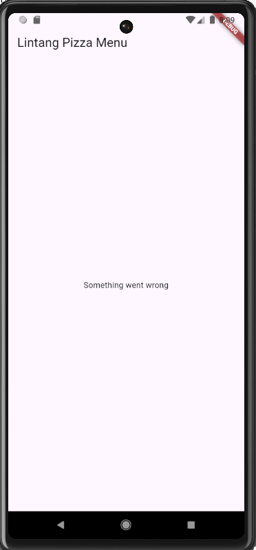
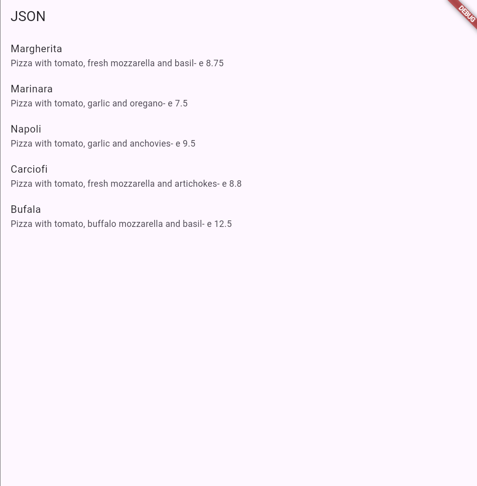

### B. Praktikum 2. POST-ing data

#### > 1. Masuk ke layanan Lab Mock di https://app.wiremock.cloud/ dan klik bagian Stubs, kemudian, buatlah stub baru.

#### > 2. Lengkapi isian seperti gambar berikut:

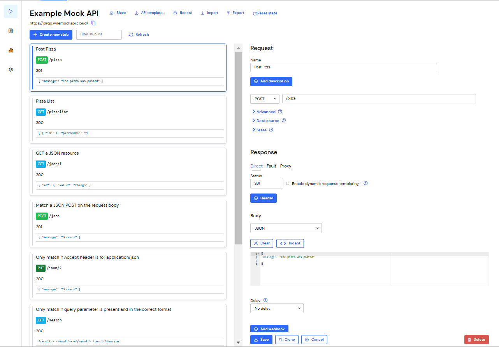

#### > 3. Simpan.

#### > 4. Di proyek Flutter, di file httpHelper.dart, di kelas HttpHelper, buat metode baru bernama postPizza, lengkapi kode sebagai berikut.

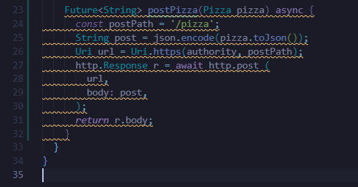

#### > 5. Di dalam proyek, buat sebuah file baru bernama pizza_detail.dart.

#### > 6. Di bagian atas file baru, tambahkan impor yang diperlukan.

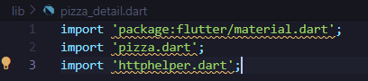

#### > 7. Buat StatefulWidget bernama PizzaDetailScreen.

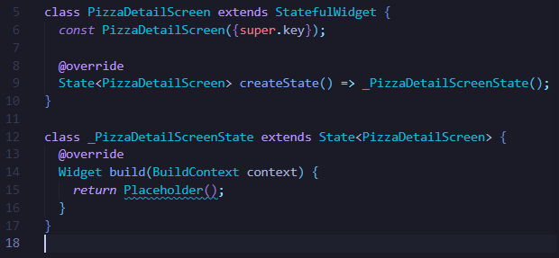

#### > 8. Di bagian atas kelas \_PizzaDetailScreenState, tambahkan lima widget TextEditingController. Widget ini akan berisi data untuk objek Pizza yang akan diposting nanti. Juga, tambahkan sebuah String yang akan berisi hasil dari permintaan POST.

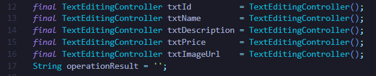

- TextField: Setiap TextField memiliki kontrol terhubung dengan TextEditingController yang dideklarasikan di atas.
- Tombol Save: Tombol Save Pizza memanggil metode POST melalui HttpHelper, mengirim data pizza baru ke API.
- Hasil Operasi: operationResult diperbarui menggunakan setState(), dan ditampilkan di bawah tombol untuk memberi umpan balik kepada pengguna.

#### > 9. Override metode dispose() untuk membuang controllers

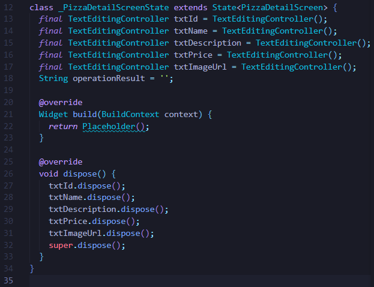

digunakan untuk membersihkan resource yang tidak lagi diperlukan, seperti TextEditingController, guna menghindari kebocoran memori saat widget PizzaDetailScreen dihapus dari widget tree. Metode ini memanggil dispose() pada setiap controller, seperti txtId.dispose(), txtName.dispose(), dan seterusnya, untuk melepaskan memori yang digunakan. Pemanggilan super.dispose() memastikan pembersihan resource pada parent class juga dilakukan. Dengan implementasi ini, aplikasi akan tetap optimal dan tidak mengalami masalah performa akibat penggunaan resource yang tidak dibersihkan.

#### > 10. Dalam metode build() pada kelas, kita return sebuah Scaffold, yang AppBar-nya berisi Teks yang menyatakan “Detail Pizza” dan Body-nya berisi Padding dan SingleChildScrollView yang berisi Column.

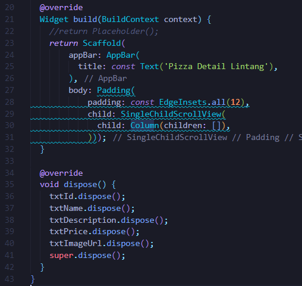

Pada kode ini, pertama-tama ditambahkan beberapa TextField untuk mengisi data terkait pizza, seperti ID, nama, deskripsi, harga, dan URL gambar, masing-masing dengan TextEditingController untuk menangani input pengguna. Setiap TextField diberi label yang sesuai agar pengguna tahu apa yang perlu diisi. Kemudian, ditambahkan tombol "Save Pizza" yang nantinya dapat digunakan untuk mengirim data ke server atau menyimpan data pizza yang diinput. Jika ada pesan hasil operasi, seperti konfirmasi penyimpanan, pesan tersebut akan ditampilkan di bawah tombol. Di bagian dispose(), semua TextEditingController dibersihkan setelah pengguna selesai, untuk menghindari kebocoran memori.

#### > 11. Untuk properti anak dari Column, tambahkan beberapa Text yang akan berisi hasil posting, lima TextFields, masing-masing terikat pada TextEditingController, dan sebuah ElevatedButton untuk menyelesaikan aksi POST (metode postPizza akan dibuat berikutnya). Juga, tambahkan SizedBox untuk memberi jarak pada widget di layar.

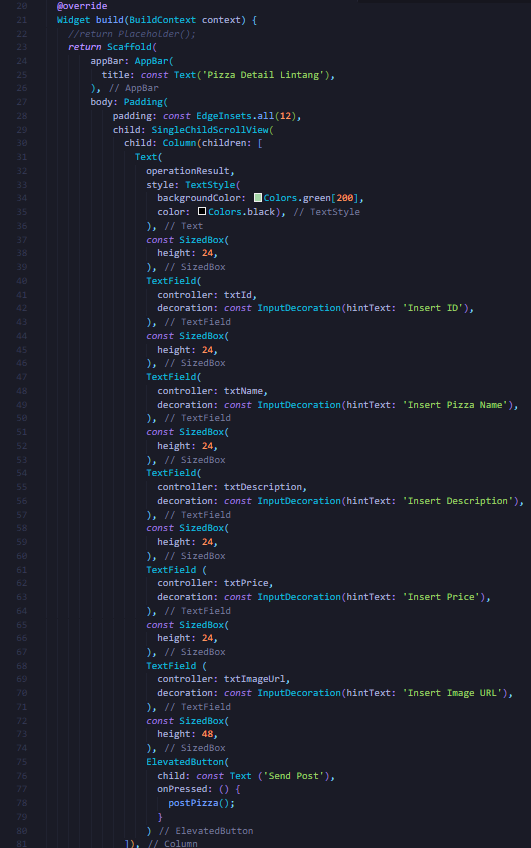

#### > 12. Di bagian bawah kelas \_PizzaDetailState, tambahkan metode postPizza.

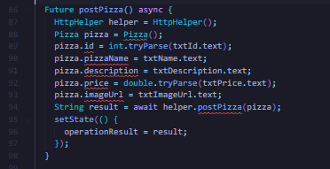

Metode ini dipanggil ketika tombol "Send Post" ditekan, yang akan membuat objek Pizza baru, mengisi atribut-atributnya dengan data dari TextField, dan kemudian memanggil HttpHelper().postPizza(pizza) untuk mengirim data tersebut. Hasil dari permintaan tersebut (string result) akan disimpan dalam variabel operationResult dan ditampilkan di UI menggunakan setState(), yang akan memicu pembaruan tampilan widget.

#### > 13. Di file main.dart, impor file pizza_detail.dart.

#### > 14. Di perancah metode build() dari kelas \_MyHomePageState, tambahkan FloatingActionButton yang akan menavigasi ke rute PizzaDetail.

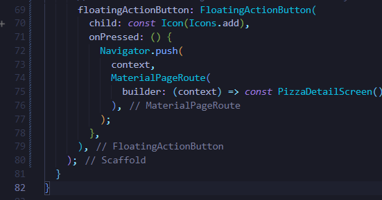

#### > 15. Jalankan aplikasi. Pada layar utama, tekan FloatingActionButton untuk menavigasi ke rute PizzaDetail

#### > 16. Tambahkan detail pizza di kolom teks dan tekan tombol Kirim Postingan. Anda akan melihat hasil yang berhasil, seperti yang ditunjukkan pada gambar berikut.

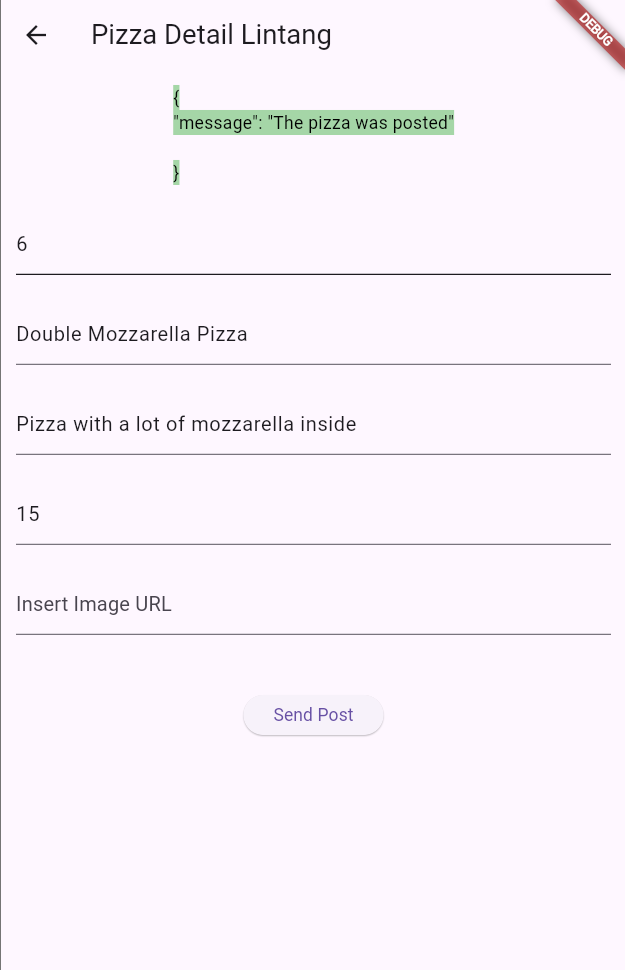

### > C. Praktikum 3, PUT-ting data

#### > 1. Masuk ke layanan Lab Mock di https://app.wiremock.cloud/ dan klik bagian Stubs, kemudian, buatlah stub baru.

#### > 2. Lengkapi isian seperti gambar berikut:

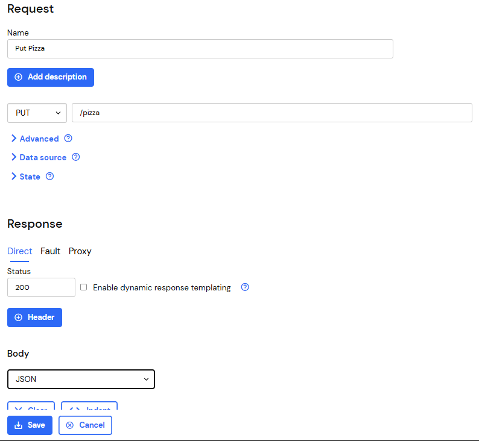

#### > 3. Simpan

#### > 4. Di proyek Flutter, tambahkan metode putPizza ke kelas HttpHelper di file http_helper.dart

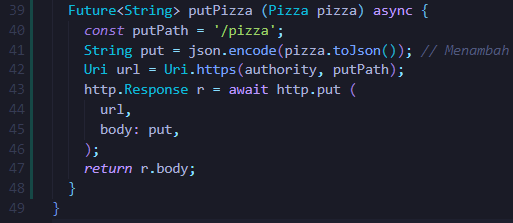

#### > 5. Di kelas PizzaDetailScreen di file pizza_detail.dart, tambahkan dua properti, Pizza dan boolean, dan di konstruktor, atur dua properti tersebut

    final Pizza pizza;
    final bool isNew;
    const PizzaDetailScreen(
        {super.key, required this.pizza, required this.isNew}
    );

#### > 6. Di kelas PizzaDetailScreenState, override metode initState. Bila properti isNew dari kelas PizzaDetail tidak baru, properti ini akan menetapkan konten TextFields dengan nilai objek Pizza yang dilewatkan

    @override
    void initState() {
        if (!widget.isNew) {
        txtId.text = widget.pizza.id.toString();
        txtName.text = widget.pizza.pizzaName;
        txtDescription.text = widget.pizza.description;
        txtPrice.text = widget.pizza.price.toString();
        txtImageUrl.text = widget.pizza.imageUrl;
        }
        super.initState();
    }

#### > 7. Edit metode savePizza sehingga memanggil metode helper.postPizza ketika properti isNew bernilai benar, dan helper.putPizza ketika bernilai salah

    Future savePizza() async {
        HttpHelper helper = HttpHelper();
        Pizza pizza = Pizza(
        id: int.tryParse(txtId.text) ?? 0,
        pizzaName: txtName.text,
        description: txtDescription.text,
        price: double.tryParse(txtPrice.text) ?? 0.0,
        imageUrl: txtImageUrl.text,
        );

        final result = await (widget.isNew
            ? helper.postPizza(pizza)
            : helper.putPizza(pizza));

        setState(() {
        operationResult = result;
        });
    }

#### > 8. Di file main.dart, di metode build \_MyHomePageState, tambahkan properti onTap ke ListTile sehingga saat pengguna mengetuknya, aplikasi akan mengubah rute dan menampilkan layar PizzaDetail, dengan menampilkan data pizza yang ada saat ini dan menjadikan false untuk parameter isNew

     return ListView.builder(
            itemCount: snapshot.data!.length,
            itemBuilder: (BuildContext context, int position) {
              final Pizza currentPizza = snapshot.data![position];
              return ListTile(
                title: Text(currentPizza.pizzaName),
                subtitle: Text(
                  '${currentPizza.description} - € ${currentPizza.price.toStringAsFixed(2)}',
                ),
                onTap: () {
                  Navigator.push(
                    context,
                    MaterialPageRoute(
                      builder: (context) => PizzaDetailScreen(
                        pizza: currentPizza,
                        isNew: false, // Editing existing pizza
                      ),
                    ),
                  );
                },
              );
            },
          );

#### > 9. Di floatingActionButton, passing data Pizza baru dan menjadikan true untuk parameter isNew ke rute PizzaDetail

    floatingActionButton: FloatingActionButton(
        child: const Icon(Icons.add),
        onPressed: () {
          Navigator.push(
            context,
            MaterialPageRoute(
              builder: (context) => PizzaDetailScreen(
                pizza: Pizza(
                  id: 0, // Default values for a new pizza
                  pizzaName: '',
                  description: '',
                  price: 0.0,
                  imageUrl: '',
                ),
                isNew: true, // Adding a new pizza
              ),
            ),
          );
        },
      ),

#### > 10. Jalankan aplikasi. Pada layar utama, ketuk Pizza mana pun untuk menavigasi ke rute PizzaDetail

#### > 11. Edit detail pizza di kolom teks dan tekan tombol Simpan. Anda akan melihat pesan yang menunjukkan bahwa detail pizza telah diperbarui

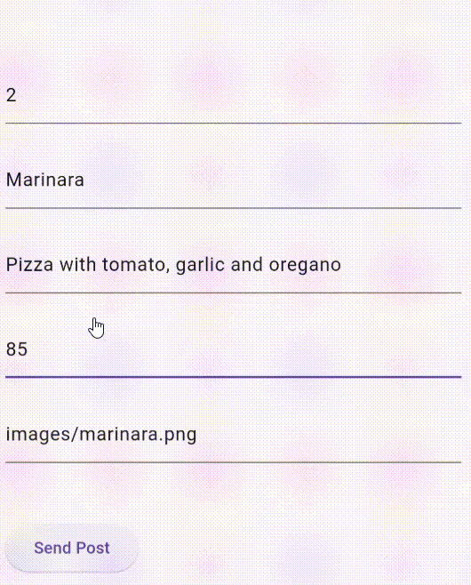

### > D. Praktikum 4, DELETE-ing data

#### > 1. Masuk ke layanan Wiremock di https://app.wiremock.cloud dan klik pada bagian Stubs pada contoh API. Kemudian, buatlah sebuah stub baru

#### > 2. Lengkapi isian, dengan data berikut:

#### > 3. Save the new stub

#### > 4. Di proyek Flutter, tambahkan metode deletePizza ke kelas HttpHelper di file http_helper.dart

    Future<String> deletePizza(int id) async {
        const deletePath = '/pizza';
        Uri url = Uri.https(authority, deletePath);
        http.Response r = await http.delete(
        url,
        );
        return r.body;
    }

#### > 5. Pada file main.dart, di metode build kelas \_MyHomePageState, refaktor itemBuilder dari ListView.builder agar ListTile terdapat dalam widget Dismissible, seperti berikut

        return ListView.builder(
            itemCount: snapshot.data!.length,
            itemBuilder: (BuildContext context, int position) {
              return Dismissible(
                key: Key(snapshot.data![position].id.toString()),
                onDismissed: (direction) {
                  setState(() {
                    HttpHelper helper = HttpHelper();
                    // Save the deleted pizza details before removing it
                    Pizza deletedPizza = snapshot.data![position];

                    // Call delete API
                    helper.deletePizza(deletedPizza.id);

                    // Remove the pizza from the list
                    snapshot.data!.removeAt(position);

                    // Log the deletion in the console
                    print(
                        "Deleted Pizza: ${deletedPizza.pizzaName} (ID: ${deletedPizza.id})");
                  });
                },
                child: ListTile(
                  title: Text(snapshot.data![position].pizzaName),
                  subtitle: Text(
                    '${snapshot.data![position].description} - € ${snapshot.data![position].price.toStringAsFixed(2)}',
                  ),
                  onTap: () {
                    Navigator.push(
                      context,
                      MaterialPageRoute(
                        builder: (context) => PizzaDetailScreen(
                          pizza: snapshot.data![position],
                          isNew: false,
                        ),
                      ),
                    );
                  },
                ),
              );
            },
          );

#### > 6. Jalankan aplikasi. Saat Anda menggeser elemen apa pun dari daftar pizza, ListTile akan menghilang

