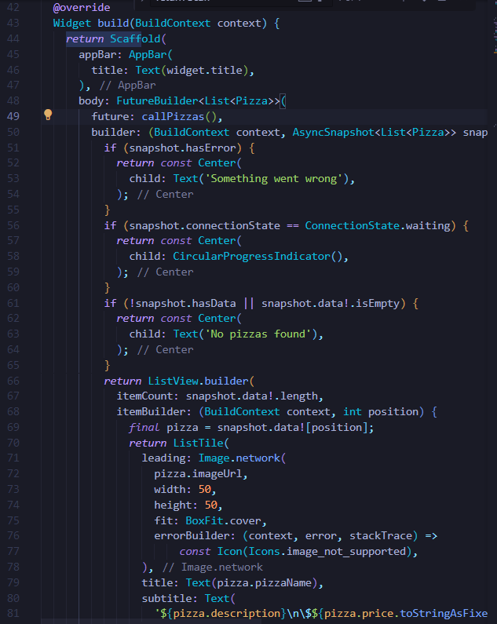

# Pemrograman Mobile

---

Nama : Lintang Aprillya Sari Sari

Kelas : 3C / 13

NIM : 2241720231

---

## Jobsheet 14 : Restful API

### A. Praktikum 1, Designing an HTTP client and getting data

#### > 1. Mendaftarlah ke layanan Lab Mock di https://app.wiremock.cloud/. Bisa anda gunakan akun google untuk mendaftar. Jika berhasil bendaftar dan login, akan muncul seperti gambar berikut.

#### > 2. Di halaman dahsboard, klik menu Stubs, kemudian klik entri pertama yaitu “GET a JSON resource”. Anda akan melihat layar yang mirip dengan berikut.

#### > 3. Klik “Create new stub”. Di kolom sebelah kanan, lengkapi data berikut. Namanya adalah “Pizza List”, kemudian pilih GET dan isi dengan “/pizzalist”. Kemudian, pada bagian Response, untuk status 200, kemudian pada Body pilih JSON sebagai formatnya dan isi konten JSON dari https://bit.ly/pizzalist. Perhatikan gambar berikut.

#### > 4. Tekan tombol SAVE di bagian bawah halaman untuk menyimpan Mock ini. Jika berhasil tersimpan, maka Mock API sudah siap digunakan.

#### > 5. Buatlah project flutter baru dengan nama pizza_api_nama_anda, tambahkan depedensi “http” melalui terminal.

Fungsi dari perintah flutter pub add http adalah untuk menambahkan package http ke dalam proyek Flutter yang sedang dikerjakan. Package ini sering digunakan untuk melakukan permintaan HTTP, seperti GET, POST, PUT, dan DELETE, yang memungkinkan aplikasi Flutter untuk berkomunikasi dengan server atau API.

#### > 6. DI folder “lib” project anda, tambahkan file dengan nama “httphelper.dart”.

#### > 7. Isi httphelper.dart dengan kode berikut. Ubah “02z2g.mocklab.io” dengan URL Mock API anda.

Kode ini digunakan untuk mengakses data dari API yang menyediakan daftar pizza, mengonversi data JSON yang diterima menjadi objek Pizza, lalu mengembalikannya untuk digunakan di aplikasi Flutter.

#### > 8. Di file “main.dart”, di class \_ MyHomePageState, tambahkan metode bernama “callPizzas”. Metode ini mengembalikan sebuah Future dari daftar objek Pizza dengan memanggil metode getPizzaList dari kelas HttpHelper, dengan kode sebagai berikut:

#### > 9. Pada metode build di class \_MyHomePageState, di dalam body Scaffold, tambahkan FutureBuilder yang membuat ListView dari widget ListTile yang berisi objek Pizza:

#### >

#### >

#### >

#### >

#### >

#### >

#### >

#### >

#### >

#### >

#### >

#### >

#### >

#### >

#### >

#### >

#### >

#### >

#### >

#### >

#### >

#### >

#### >

#### >

#### >

#### >

#### >

#### >

#### >

#### >

#### >

#### >

#### >
