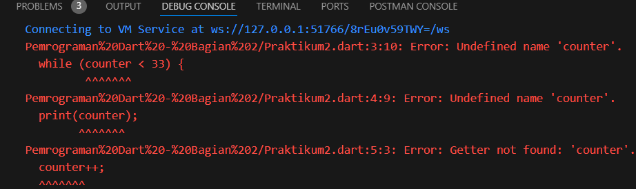

# Pemrograman Mobile

Nama : Lintang Aprillya Sari Sari

Kelas : 2C / 11

NIM : 2241720231

## Jobsheet 3 : Pengantar Bahasa Pemrograman Dart - Bagian 2

### Praktikum 1 : Menerapkan Control Flows ("if/else")

Selesaikan langkah-langkah praktikum berikut ini menggunakan DartPad di browser Anda.

#### Langkah 1:

Ketik atau salin kode program berikut ke dalam fungsi main().
(
)

#### Langkah 2:

Silakan coba eksekusi (Run) kode pada langkah 1 tersebut. Apa yang terjadi? Jelaskan!

jawab :
(
)

Ketika kode dieksekusi, program pertama-tama mengecek apakah variabel test bernilai "test1", yang salah, sehingga lanjut ke kondisi else if (test == "test2"), yang benar, dan mencetak "Test2". Selanjutnya, program memeriksa kondisi if (test == "test2") lagi, dan mencetak "Test2 again". Terakhir, variabel boolean isTrue bernilai true, sehingga program mencetak "Kebenaran". Hasil akhir di konsol adalah: "Test2", "Test2 again", dan "Kebenaran".

#### Langkah 3:

Tambahkan kode program berikut, lalu coba eksekusi (Run) kode Anda.

(
)

Jawab :

(.png>)
)

hasil run :

(.png>)
)

Program memeriksa nilai variabel test yang diatur menjadi "test2". Pada pemeriksaan pertama, kondisi if (test == "test1") salah, sehingga kode melanjutkan ke else if (test == "test2"), yang benar dan mencetak "Test2". Program kemudian memeriksa lagi if (test == "test2") dan mencetak "Test2 again" karena kondisinya benar. Terakhir, karena isTrue diatur ke true, kondisi if (isTrue) juga benar, sehingga mencetak "Kebenaran".

### Praktikum 2 : Menerapkan Perulangan "while" dan "do-while"

Selesaikan langkah-langkah praktikum berikut ini menggunakan DartPad di browser Anda.

#### Langkah 1 :

Ketik atau salin kode program berikut ke dalam fungsi main().

(
)

#### Langkah 2 :

Silakan coba eksekusi (Run) kode pada langkah 1 tersebut. Apa yang terjadi? Jelaskan! Lalu perbaiki jika terjadi error.

Jawab :

(
)

Kode yang diberikan akan menghasilkan error karena variabel counter belum dideklarasikan dan diinisialisasi. Untuk memperbaikinya, deklarasikan counter sebagai int dan inisialisasi dengan nilai 0 sebelum loop. Setelah perbaikan, kode akan mencetak nilai dari 0 hingga 32, masing-masing pada baris baru, dengan counter bertambah 1 setiap iterasi hingga mencapai 33.

lalu diupdate spti berikut :

(.png>)
)

Akan menampilkan angka yang dimulai dari 0 sampai 32. Karena di kode tersebut Perulangan dimulai dengan counter = 0. Pada iterasi pertama, 0 dicetak, lalu counter ditingkatkan menjadi 1. Pada iterasi kedua, 1 dicetak, lalu counter ditingkatkan menjadi 2. Proses ini berlanjut hingga counter mencapai 32. Setelah 32 dicetak dan counter ditingkatkan menjadi 33, kondisi while (counter < 33) tidak lagi terpenuhi, sehingga perulangan berhenti.

#### Langkah 3 :

Tambahkan kode program berikut, lalu coba eksekusi (Run) kode Anda.

(
)

Apa yang terjadi ? Jika terjadi error, silakan perbaiki namun tetap menggunakan do-while.

Jawab :

(.png>)
)

Ketika kode dijalankan, outputnya akan mencetak angka dari 0 hingga 32 diikuti oleh angka dari 33 hingga 76. Pertama, loop while mencetak angka dari 0 hingga 32, dengan counter bertambah 1 setiap iterasi hingga mencapai 33. Setelah itu, loop do-while mencetak angka mulai dari 33 hingga 76, memastikan setidaknya satu kali cetakan sebelum memeriksa kondisi akhir (counter < 77), dan terus mencetak hingga counter mencapai 77.

### Praktikum 3 : Menerapkan Perulangan "for" dan "break-continue"

Selesaikan langkah-langkah praktikum berikut ini menggunakan DartPad di browser Anda.

#### Langkah 1 :

Ketik atau salin kode program berikut ke dalam fungsi main().

(
)

#### Langkah 2 :

Silakan coba eksekusi (Run) kode pada langkah 1 tersebut. Apa yang terjadi? Jelaskan! Lalu perbaiki jika terjadi error.

Jawab :

(
)

Error dikarenakan variabel index belum dideklarasikan dan di inisialisasi. Maka ditambahkan

void main() {
for (int index = 10; index < 27; index++) {
print(index);
}
}

(.png>)
)

Maka, program mencetak angka dari 10 hingga 26 secara berurutan, masing-masing pada baris yang terpisah

#### Langkah 1 :

Tambahkan kode program berikut di dalam for-loop, lalu coba eksekusi (Run) kode Anda.

(
)

#### Langkah 2 :

Silakan coba eksekusi (Run) kode pada langkah 1 tersebut. Apa yang terjadi? Jelaskan! Lalu perbaiki jika terjadi error.

Jawab :

(.png>)
)

Ketika kode dijalankan, outputnya akan mencetak angka dari 10 hingga 26, masing-masing pada baris baru. Loop for dimulai dengan index diatur ke 10 dan akan terus berjalan selama index kurang dari 27. Pada setiap iterasi, nilai index dicetak dan kemudian ditambah 1 hingga index mencapai 27, pada titik ini loop berhenti.

#### Langkah 3 :

Tambahkan kode program berikut di dalam for-loop, lalu coba eksekusi (Run) kode Anda.

(.png>)
)

Apa yang terjadi ? Jika terjadi error, silakan perbaiki namun tetap menggunakan for dan break-continue.

Jawab : tidak terjadi error

### Tugas Praktikum

#### Buatlah sebuah program yang dapat menampilkan bilangan prima dari angka 0 sampai 201 menggunakan Dart. Ketika bilangan prima ditemukan, maka tampilkan nama lengkap dan NIM Anda.

Jawab :

(
)

output :

(
)

(
)

(
)

(
)
