# Pemrograman Mobile

---

Nama : Lintang Aprillya Sari Sari

Kelas : 2C / 11

## NIM : 2241720231

## Jobsheet 4 : Pengantar Bahasa Pemrograman Dart - Bagian 3

### Praktikum 1 : Eksperimen Tipe Data List

Selesaikan langkah-langkah praktikum berikut ini menggunakan VS Code atau Code Editor favorit Anda.

#### Langkah 1:

(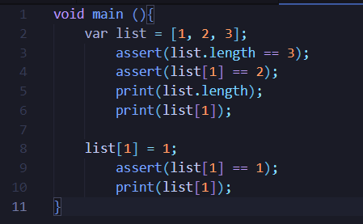
)

#### Langkah 2:

Silakan coba eksekusi (Run) kode pada langkah 1 tersebut. Apa yang terjadi? Jelaskan!

Jawab :

(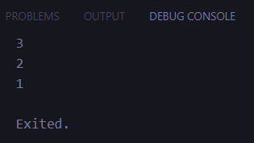
)

Program memeriksa (menggunakan assert) bahwa panjang list adalah 3 dan elemen kedua (indeks 1) memiliki nilai 2. Jika assert benar, program melanjutkan dengan mencetak panjang list dan elemen kedua. Setelah itu, nilai elemen kedua diubah menjadi 1, dan assert kembali memeriksa apakah perubahan tersebut benar. Jika tidak ada kesalahan, elemen kedua yang baru dicetak. Jika salah satu assert gagal, program akan menampilkan error. Secara keseluruhan, kode ini mendemonstrasikan manipulasi dan validasi sederhana pada list di Dart.

#### Langkah 3:

Ubah kode pada langkah 1 menjadi variabel final yang mempunyai index = 5 dengan default value = null. Isilah nama dan NIM Anda pada elemen index ke-1 dan ke-2. Lalu print dan capture hasilnya.

Apa yang terjadi ? Jika terjadi error, silakan perbaiki.

Jawab :

(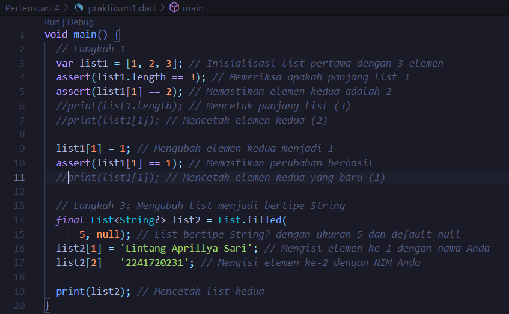
)

output :

(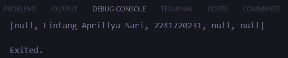
)

Output dari kode ini hanya mencetak list kedua (list2), yang terdiri dari lima elemen dengan nilai null di sebagian besar tempat kecuali indeks ke-1 dan ke-2, yang diisi dengan nama dan NIM saya, yang dimana elemen indeks ke-1 berisi "Lintang Aprillya Sari" dan indeks ke-2 berisi "2241720231", sedangkan elemen lainnya tetap null.

### Praktikum 2 : Eksperimen Tipe Data Set

Selesaikan langkah-langkah praktikum berikut ini menggunakan VS Code atau Code Editor favorit Anda.

#### Langkah 1:

Ketik atau salin kode program berikut ke dalam fungsi main().

(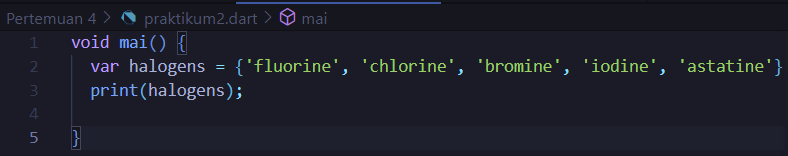
)

#### Langkah 2:

Silakan coba eksekusi (Run) kode pada langkah 1 tersebut. Apa yang terjadi? Jelaskan! Lalu perbaiki jika terjadi error.

Jawab :

(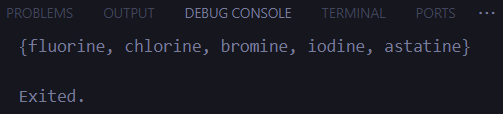
)

Kode tersebut mendefinisikan sebuah Set bernama halogens yang berisi lima elemen: 'fluorine', 'chlorine', 'bromine', 'iodine', dan 'astatine'. Dalam Dart, Set adalah kumpulan unik dari elemen-elemen yang tidak memiliki urutan dan tidak mengizinkan duplikasi. Kode ini kemudian mencetak isi dari set halogens menggunakan print(). Output akan menampilkan elemen-elemen dalam set, meskipun urutannya tidak dijamin sama seperti saat deklarasi, karena set tidak memiliki urutan tetap.

#### Langkah 3:

Tambahkan kode program berikut, lalu coba eksekusi (Run) kode Anda.

(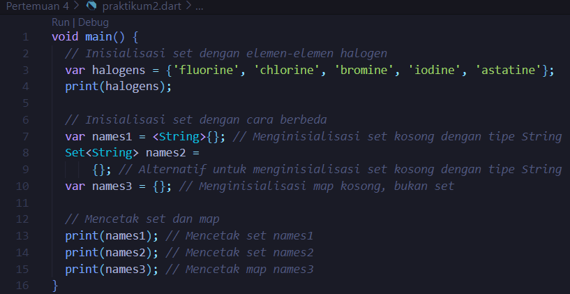
)

Apa yang terjadi ? Jika terjadi error, silakan perbaiki namun tetap menggunakan ketiga variabel tersebut. Tambahkan elemen nama dan NIM Anda pada kedua variabel Set tersebut dengan dua fungsi berbeda yaitu .add() dan .addAll(). Untuk variabel Map dihapus, nanti kita coba di praktikum selanjutnya.

Dokumentasikan code dan hasil di console, lalu buat laporannya.

Jawab :

(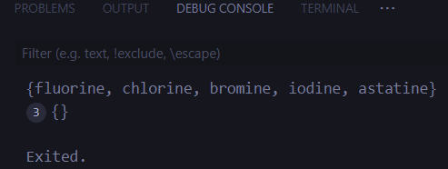
)

Hasil tersebut menunjukkan perbedaan antara set dan map dalam Dart serta cara menginisialisasi set kosong.

penambahan nama dan nim :

(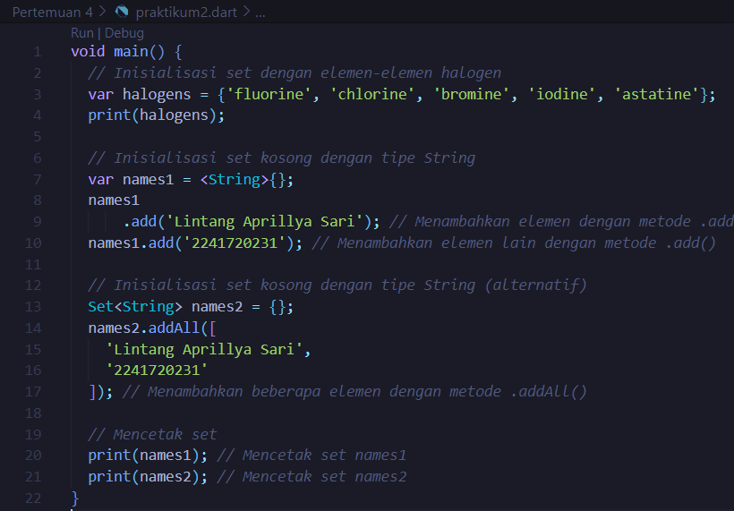
)

output :

(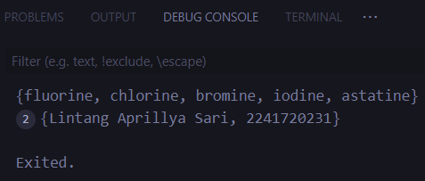
)

Kode tersebut menginisialisasi dua set kosong, names1 dan names2, untuk menyimpan nama dan NIM. Pada names1, elemen ditambahkan satu per satu menggunakan metode .add(), sedangkan pada names2, beberapa elemen ditambahkan sekaligus menggunakan metode .addAll(). Output mencetak set halogens yang berisi elemen-elemen halogen, dan kemudian mencetak names1 dan names2 yang berisi nama dan NIM yang ditambahkan. Variabel names3 yang dideklarasikan sebagai map dihapus dari kode, sehingga hanya set yang ditampilkan.

### Praktikum 3 : Eksperimen Tipe Data Maps

Selesaikan langkah-langkah praktikum berikut ini menggunakan VS Code atau Code Editor favorit Anda.

#### Langkah 1:

Ketik atau salin kode program berikut ke dalam fungsi main().

(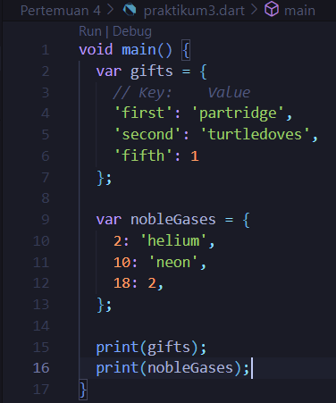
)

#### Langkah 2:

Silakan coba eksekusi (Run) kode pada langkah 1 tersebut. Apa yang terjadi? Jelaskan! Lalu perbaiki jika terjadi error.

Jawab :

(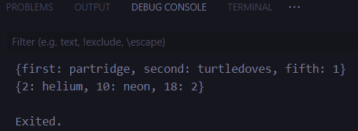
)

Kode tersebut mendefinisikan dua map: gifts dan nobleGases. Map gifts berisi pasangan key-value dengan key berupa string dan value berupa string atau integer, sedangkan map nobleGases berisi pasangan key-value dengan key berupa integer dan value berupa string atau integer. Ketika dicetak, gifts akan menampilkan pasangan key-value dengan key 'first', 'second', dan 'fifth' dengan nilai masing-masing 'partridge', 'turtledoves', dan 1. Map nobleGases akan menampilkan pasangan key-value dengan key 2, 10, dan 18 dengan nilai 'helium', 'neon', dan 2. Output menunjukkan struktur dan isi dari kedua map tersebut.

#### Langkah 3:

Tambahkan kode program berikut, lalu coba eksekusi (Run) kode Anda.

(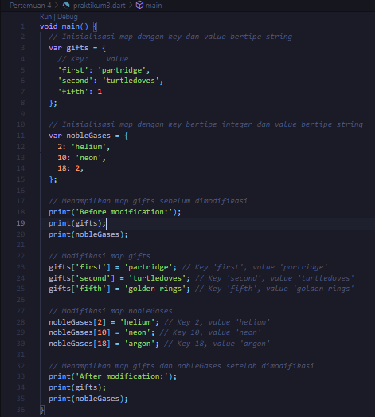
)

Apa yang terjadi ? Jika terjadi error, silakan perbaiki.

Jawab :

(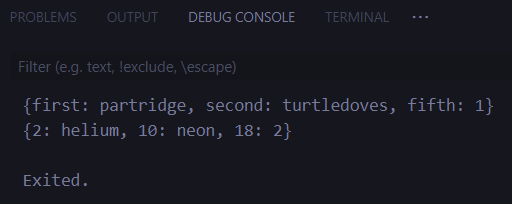
)

Output kode menunjukkan perubahan yang terjadi pada map gifts dan nobleGases setelah dimodifikasi. Sebelum modifikasi, gifts memiliki nilai awal dengan key 'first', 'second', dan 'fifth' masing-masing diisi dengan 'partridge', 'turtledoves', dan 1, sementara nobleGases berisi key 2, 10, dan 18 dengan nilai 'helium', 'neon', dan 2. Setelah modifikasi, gifts diperbarui dengan 'golden rings' untuk key 'fifth', dan nobleGases diperbarui dengan 'argon' untuk key 18. Output akhir mencerminkan nilai terbaru yang ditetapkan pada kedua map.

Tambahkan elemen nama dan NIM Anda pada tiap variabel di atas (gifts, nobleGases, mhs1, dan mhs2).

Jawab :

(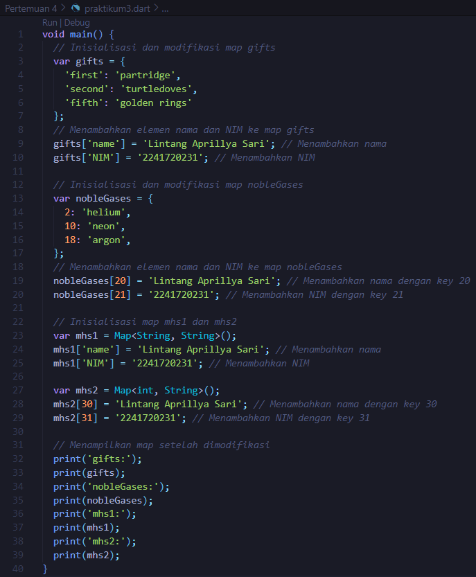
)

output :

(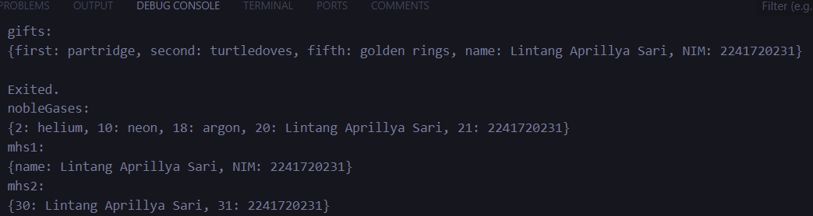
)

Output dari kode tersebut menampilkan empat map yang telah dimodifikasi dengan menambahkan elemen nama dan NIM. Map gifts sekarang berisi key 'name' dan 'NIM' dengan nilai nama dan NIM Anda, sedangkan nobleGases berisi key 20 dan 21 dengan nilai yang sama. Map mhs1 dan mhs2 masing-masing diisi dengan nama dan NIM Anda menggunakan key bertipe String dan int. Output menunjukkan semua map dengan elemen baru yang ditambahkan, menggambarkan struktur data yang diupdate.

### Praktikum 4 : Eksperimen Tipe Data List: Spread dan Control-flow Operators

Selesaikan langkah-langkah praktikum berikut ini menggunakan VS Code atau Code Editor favorit Anda.

#### Langkah 1:

Ketik atau salin kode program berikut ke dalam fungsi main().

(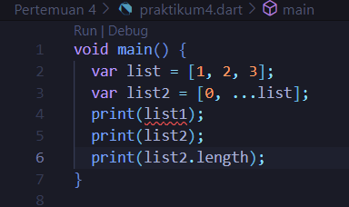
)

#### Langkah 2:

Silakan coba eksekusi (Run) kode pada langkah 1 tersebut. Apa yang terjadi? Jelaskan! Lalu perbaiki jika terjadi error.

Jawab :

(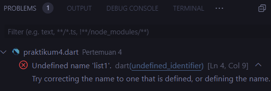
)

Terjadi error karena salah pemanggilan nama variabel

pembetulan :

(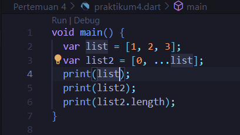
)

output :

(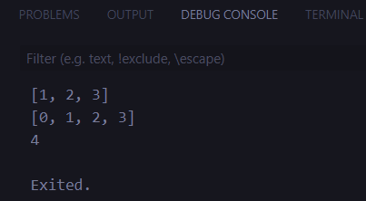
)

disini sudah saya update untuk pemanggilan namanya.

#### Langkah 3:

Tambahkan kode program berikut, lalu coba eksekusi (Run) kode Anda.

(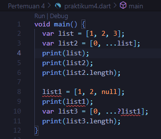
)

Apa yang terjadi ? Jika terjadi error, silakan perbaiki.

Jawab :

Terjadi error, karena ...?list1 digunakan untuk menyebarkan elemen-elemen dari list1 ke list3, termasuk elemen yang null. Namun, jika list1 mengandung null sebagai elemen, maka Dart akan mengeluarkan error saat mencoba menyebarkannya dengan ... karena null bukanlah iterabel yang valid.

(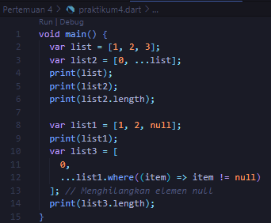
)

Disini, telah saya update

output :

(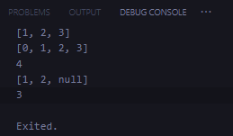
)

list3: Akan berisi [0, 1, 2] tanpa elemen null, dan panjangnya adalah 3

Tambahkan variabel list berisi NIM Anda menggunakan Spread Operators. Dokumentasikan hasilnya dan buat laporannya!

Jawab :

(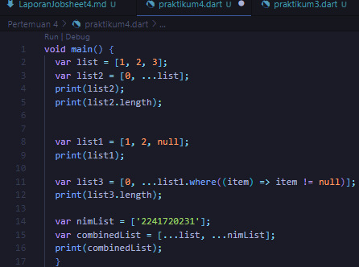
)

telah saya update menjadi ada nimnya, berikut merupakan outputnya

(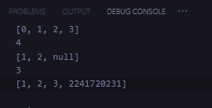
)

diatas itu merupakan outputnya.

#### Langkah 4:

Tambahkan kode program berikut, lalu coba eksekusi (Run) kode Anda.

(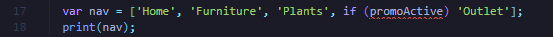
)

Apa yang terjadi ? Jika terjadi error, silakan perbaiki. Tunjukkan hasilnya jika variabel promoActive ketika true dan false.

Jawab : terjadi error, berikut update source codenya

- kondisi true

(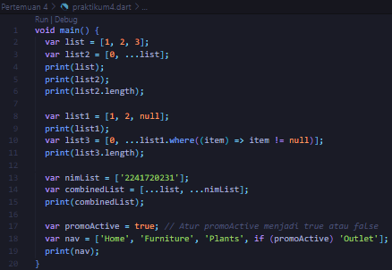
)

output :

(
)

- kondisi false

(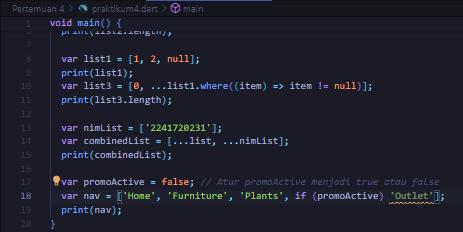
)

output :

(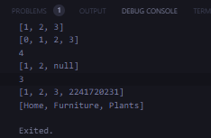
)

#### Langkah 5:

Tambahkan kode program berikut, lalu coba eksekusi (Run) kode Anda.

(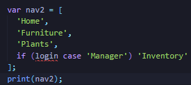
)

Apa yang terjadi ? Jika terjadi error, silakan perbaiki. Tunjukkan hasilnya jika variabel login mempunyai kondisi lain.

Jawab : Terjadi error dengan kode berikut

(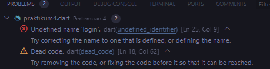
)

lalu diupdate menjadi :

- declare menggunakan nilai Manager

(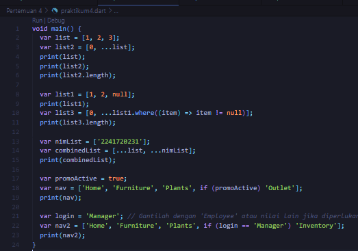
)

output :

(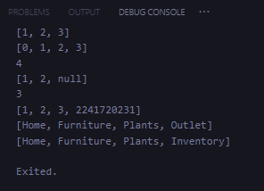
)

- declare dengan menggunakan nilai employee

(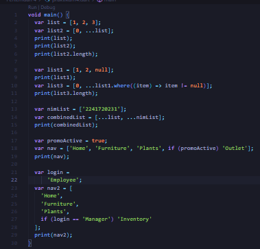
)

output :

(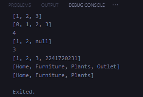
)

#### Langkah 6

Tambahkan kode program berikut, lalu coba eksekusi (Run) kode Anda.

(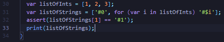
)

output :

(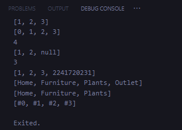
)

Apa yang terjadi ? Jika terjadi error, silakan perbaiki. Jelaskan manfaat Collection For dan dokumentasikan hasilnya.

Jawab :

Collection For adalah fitur Dart yang memudahkan pembuatan koleksi seperti list, set, atau map dengan menggunakan sintaks loop for langsung dalam deklarasi koleksi. Ini memungkinkan Anda untuk membuat koleksi yang diisi dengan elemen yang dihasilkan secara dinamis dalam satu baris kode, menjadikannya lebih ringkas dan mudah dibaca, serta mengurangi kemungkinan kesalahan dan meningkatkan efisiensi.

### Praktikum 5 : Eksperimen Tipe Data Records

Selesaikan langkah-langkah praktikum berikut ini menggunakan VS Code atau Code Editor favorit Anda.

#### Langkah 1:

Ketik atau salin kode program berikut ke dalam fungsi main().

(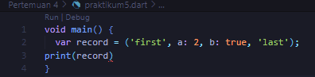
)

#### Langkah 2:

Silakan coba eksekusi (Run) kode pada langkah 1 tersebut. Apa yang terjadi? Jelaskan! Lalu perbaiki jika terjadi error.

Jawab : terjadi error karena tidak ada ;

(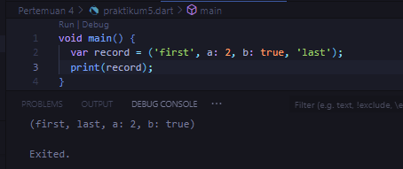
)

#### Langkah 3:

Tambahkan kode program berikut di luar scope void main(), lalu coba eksekusi (Run) kode Anda.

Apa yang terjadi ? Jika terjadi error, silakan perbaiki. Gunakan fungsi tukar() di dalam main() sehingga tampak jelas proses pertukaran value field di dalam Records.

Jawab :

(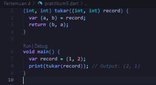
)

#### Langkah 4:

Tambahkan kode program berikut di dalam scope void main(), lalu coba eksekusi (Run) kode Anda.

(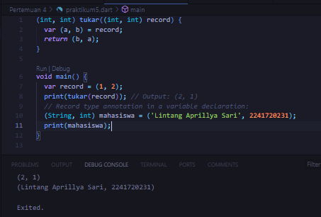
)

Jawab : terjadi error karena mahasiswa dideklarasikan tetapi tidak diinisialisasi.

perbaikan dengan nim dan nama :

(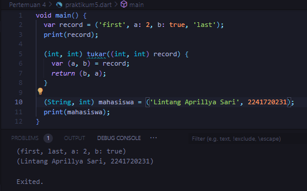
)

#### Langkah 5:

Tambahkan kode program berikut di dalam scope void main(), lalu coba eksekusi (Run) kode Anda.

(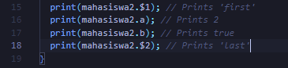
)

Apa yang terjadi ? Jika terjadi error, silakan perbaiki. Gantilah salah satu isi record dengan nama dan NIM Anda, lalu dokumentasikan hasilnya dan buat laporannya!

Jawab : tidak terjadi error

(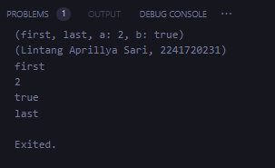
)

update dengan menggunakan nama dan nim :

(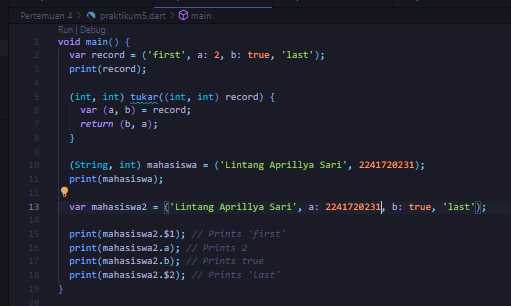
)

output :

(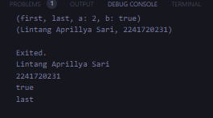
)

disini, dari outputnya sudah terlihat najwa recordnya saya ganti dengan nama dan nim saya sendiri.

### TUGAS PRAKTIKUM

#### 1. Silakan selesaikan Praktikum 1 sampai 5, lalu dokumentasikan berupa screenshot hasil pekerjaan Anda beserta penjelasannya!

#### 2. Jelaskan yang dimaksud Functions dalam bahasa Dart!

Jawab : Dalam bahasa Dart, Functions (fungsi) adalah blok kode yang dirancang untuk melakukan tugas tertentu dan bisa digunakan berulang kali di berbagai bagian program. Fungsi menerima input yang disebut parameter, menjalankan serangkaian instruksi, dan kemudian mengembalikan hasil atau nilai. Fungsi membantu membuat kode lebih terorganisir, modular, dan mudah dibaca.

#### 3. Jelaskan jenis-jenis parameter di Functions beserta contoh sintaksnya!

Jawab :

Dalam bahasa Dart, fungsi dapat memiliki berbagai jenis parameter, yang membantu menentukan cara data dikirim ke fungsi dan bagaimana fungsi tersebut beroperasi. Berikut merupakan beberapa jenis parameter yang umum digunakan :

- Parameter posisi (positional parameter) -> Parameter ini adalah parameter yang wajib diisi dan urutannya penting saat memanggil fungsi.

Contoh:void sapa(String nama, int umur) {
print('Halo, $nama! Umur Anda adalah $umur tahun.');
}
void main() {
sapa('Lintang', 22); // Output: Halo, Lintang! Umur Anda adalah 22 tahun.
}

- Parameter Opsional Posisi (Optional Positional Parameters) -> Parameter ini adalah parameter yang tidak wajib diisi, dan urutannya penting. Parameter ini diletakkan dalam tanda kurung siku [].
  Contoh:

dart
Copy code
void sapa(String nama, [int umur = 18]) {
print('Halo, $nama! Umur Anda adalah $umur tahun.');
}

void main() {
sapa('Lintang'); // Output: Halo, Lintang! Umur Anda adalah 18 tahun.
sapa('Lintang', 22); // Output: Halo, Lintang! Umur Anda adalah 22 tahun.
}

- Parameter Opsional Bernama (Optional Named Parameters) -> Parameter ini tidak wajib diisi dan dapat diberi nama. Parameter ini diletakkan dalam tanda kurung kurawal {}. Anda bisa menggunakan nama parameter saat memanggil fungsi.

Contoh:

dart
Copy code
void sapa({required String nama, int umur = 18}) {
print('Halo, $nama! Umur Anda adalah $umur tahun.');
}

void main() {
sapa(nama: 'Lintang'); // Output: Halo, Lintang! Umur Anda adalah 18 tahun.
sapa(nama: 'Lintang', umur: 22); // Output: Halo, Lintang! Umur Anda adalah 22 tahun.
}

- Parameter dengan Default Value -> Parameter ini memiliki nilai default yang digunakan jika tidak ada nilai yang diberikan saat memanggil fungsi.

Contoh:

dart
Copy code
void sapa(String nama, [int umur = 18]) {
print('Halo, $nama! Umur Anda adalah $umur tahun.');
}

void main() {
sapa('Lintang'); // Output: Halo, Lintang! Umur Anda adalah 18 tahun.
sapa('Lintang', 22); // Output: Halo, Lintang! Umur Anda adalah 22 tahun.
}

- Parameter required -> Pada parameter opsional bernama, Anda dapat menggunakan required untuk memastikan parameter tersebut harus diisi jika dideklarasikan dengan {}.

Contoh:

dart
Copy code
void sapa({required String nama, int umur = 18}) {
print('Halo, $nama! Umur Anda adalah $umur tahun.');
}

void main() {
sapa(nama: 'Lintang'); // Output: Halo, Lintang! Umur Anda adalah 18 tahun.
}

#### 4. Jelaskan maksud Functions sebagai first-class objects beserta contoh sintaknya!

Jawab :

Dalam bahasa Dart, functions sebagai first-class objects berarti bahwa fungsi dapat diperlakukan seperti objek lainnya. Artinya, fungsi dapat disimpan dalam variabel, diteruskan sebagai argumen ke fungsi lain, dan dikembalikan sebagai nilai dari fungsi. Ini memberikan fleksibilitas tinggi dalam pemrograman karena memungkinkan Anda untuk membuat fungsi yang dapat dipanggil, dimanipulasi, dan disimpan dalam koleksi.

Contoh Sintaks:
dart
Copy code
void main() {
// Menyimpan fungsi dalam variabel
var tambah = (int a, int b) => a + b;

// Menggunakan fungsi yang disimpan dalam variabel
print(tambah(3, 4)); // Output: 7

// Menggunakan fungsi sebagai argumen
void cetakHasil(int a, int b, int Function(int, int) operasi) {
print(operasi(a, b));
}

cetakHasil(5, 6, tambah); // Output: 11

// Mengembalikan fungsi dari fungsi lain
Function buatPenambah(int nilai) {
return (int a) => a + nilai;
}

var penambah5 = buatPenambah(5);
print(penambah5(10)); // Output: 15
}
Dalam contoh ini:

- Fungsi tambah disimpan dalam variabel dan dapat digunakan seperti objek lainnya.

- Fungsi cetakHasil menerima fungsi sebagai argumen dan memanggilnya.

- Fungsi buatPenambah mengembalikan fungsi baru yang menambah nilai tertentu, menunjukkan bagaimana fungsi dapat dibuat dan dikembalikan dari fungsi lain. Konsep ini memudahkan pemrograman dengan memberikan kemampuan untuk membuat fungsi yang lebih dinamis dan reusable.

#### 5. Apa itu Anonymous Functions? Jelaskan dan berikan contohnya!

Jawab :

Anonymous functions adalah fungsi yang tidak memiliki nama dan biasanya digunakan untuk tugas-tugas kecil atau fungsi sekali pakai. Mereka sering didefinisikan langsung di tempat fungsi tersebut diperlukan, seperti saat digunakan sebagai argumen untuk fungsi lain. Anonymous functions, juga dikenal sebagai lambda expressions atau lambdas, memudahkan penulisan kode yang lebih ringkas dan fleksibel tanpa harus mendefinisikan fungsi terpisah.

Contoh Sintaks:
dart
Copy code
void main() {
// Menggunakan anonymous function dalam metode `forEach`
var angka = [1, 2, 3, 4];
angka.forEach((n) => print(n \* 2)); // Output: 2 4 6 8

// Anonymous function sebagai argumen
var hasil = ((int a, int b) => a + b)(5, 7);
print(hasil); // Output: 12
}
Dalam contoh ini:

Fungsi (n) => print(n \* 2) adalah anonymous function yang digunakan dalam metode forEach untuk mencetak hasil perkalian setiap elemen array dengan 2.
Fungsi ((int a, int b) => a + b)(5, 7) adalah anonymous function yang langsung dipanggil dengan argumen 5 dan 7, dan hasilnya adalah 12.
Anonymous functions mempermudah penulisan kode yang lebih bersih dan menghindari pembuatan fungsi terpisah yang hanya digunakan di satu tempat.

#### 6. Jelaskan perbedaan Lexical scope dan Lexical closures! Berikan contohnya!

Jawab :

- Lexical scope: Variabel diakses berdasarkan di mana variabel tersebut dideklarasikan dalam hierarki fungsi.

contoh :

void main() {
var luar = 'Dunia luar'; // Variabel luar

void dalam() {
print(luar); // Mengakses variabel luar
}

dalam(); // Output: Dunia luar
}

Pada contoh di atas, fungsi dalam dapat mengakses variabel luar karena luar dideklarasikan di luar fungsi dalam.

- Lexical closures: Fungsi menangkap dan menyimpan variabel dari lingkup di mana fungsi tersebut dideklarasikan, memungkinkan akses variabel tersebut meskipun fungsi dipanggil di luar lingkup asalnya.

contoh :

Function buatPenambah(int nilai) {
return (int a) => a + nilai; // Fungsi ini menangkap 'nilai' dari lingkup di atas
}

void main() {
var penambah5 = buatPenambah(5);
print(penambah5(10)); // Output: 15
}

Pada contoh di atas, fungsi buatPenambah mengembalikan fungsi anonim yang "menangkap" variabel nilai dari lingkup asalnya. Meskipun buatPenambah telah selesai dijalankan, fungsi yang dikembalikan masih memiliki akses ke variabel nilai.

#### 7. Jelaskan dengan contoh cara membuat return multiple value di Functions!

Jawab :

- List: Cocok untuk mengembalikan nilai yang terurut dan memiliki ukuran variabel.

      Contoh :

      List<int> hitung(int a, int b) {

  return [a + b, a - b, a * b];
  }

void main() {
var hasil = hitung(5, 3);
print(hasil); // Output: [8, 2, 15]
}

Pada contoh ini, fungsi hitung mengembalikan List yang berisi hasil penjumlahan, pengurangan, dan perkalian dari dua angka.

- Map: Berguna untuk mengembalikan nilai dengan kunci yang terstruktur.

      Contoh :

      Map<String, int> hitung(int a, int b) {

  return {
  'jumlah': a + b,
  'selisih': a - b,
  'produk': a \* b
  };
  }

void main() {
var hasil = hitung(5, 3);
print(hasil); // Output: {jumlah: 8, selisih: 2, produk: 15}
}
Di sini, fungsi hitung mengembalikan Map dengan kunci yang menjelaskan hasil operasi matematika dan nilai yang sesuai.

- Tuples: Memberikan cara langsung untuk mengembalikan beberapa nilai tanpa memerlukan tipe data tambahan.

  Contoh :

  (int, int, int) hitung(int a, int b) {
  return (a + b, a - b, a \* b);
  }

void main() {
var hasil = hitung(5, 3);
print(hasil); // Output: (8, 2, 15)
}

Pada contoh ini, fungsi hitung mengembalikan tuple yang berisi hasil penjumlahan, pengurangan, dan perkalian dari dua angka.

#### 8. Kumpulkan berupa link commit repo GitHub pada tautan yang telah disediakan di grup Telegram!
