# Pemrograman Mobile

---

Nama : Lintang Aprillya Sari Sari

Kelas : 2C / 11

NIM : 2241720231

---

## Jobsheet 6 : Widget Dasar Flutter

### Praktikum 1 : Membuat Project Flutter Baru

Selesaikan langkah-langkah praktikum berikut ini menggunakan editor Visual Studio Code (VS Code) atau Android Studio atau code editor lain kesukaan Anda.

**Perhatian:** Diasumsikan Anda telah berhasil melakukan setup environment Flutter SDK, VS Code, Flutter Plugin, dan Android/iOS SDK pada Codelabs#1.

#### - Langkah 1 :

Buka VS Code, lalu tekan tombol **Ctrl + Shift + P** maka akan tampil Command Palette, lalu ketik **Flutter**. Pilih **New Application Project**.

**Jawab** :

(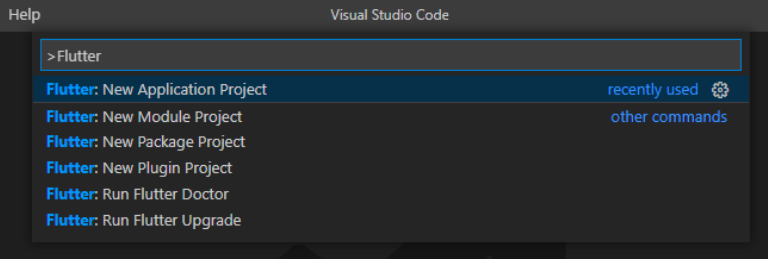
)

(.png>)
)

Jadi, disini saya membuat application project baru pada visual studio code. Yang dimana, mungkin secara tampilan tidak sama dengan yang ada di jobsheet, namun, outputnya memiliki hasil yang sama.

**Catatan**: Anda dapat mengakses **Command Palette** dengan cara lain, yaitu pilih menu **View > Command Palette**. Tombol shortcut **Ctrl + Shift + P** mungkin hanya berlaku di Windows.

#### - Langkah 2 :

Kemudian buat folder **sesuai style** laporan praktikum yang Anda pilih. Disarankan pada folder dokumen atau desktop atau alamat folder lain yang tidak terlalu dalam atau panjang. Lalu pilih **Select a folder to create the project in.**

**Jawab** :

(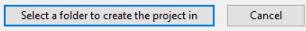
)

Jadi, pada langkah ke 2 ini, kita diminta untuk memilih dimanakah kita akan meletakkan folder project kita ini, untuk saya sendiri, saya memilih untuk memasukkan di C, dan spesifiknya di folder semester 5 saya untuk mata kuliah mobile programming.

#### - Langkah 3 :

Buat nama project flutter **hello_world** seperti berikut, lalu tekan **Enter**. Tunggu hingga proses pembuatan project baru selesai.

**Jawab** :

(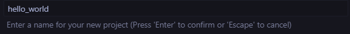
)

Disini, kita diminta untuk menamai project kita, dan nama project saya adalah hello_world yang dimana itu lowercase semua dan tidak ada spasi karena saya memberi jarak dengan underline.

**Perhatian**: Nama project ini harus lowercase (huruf kecil semua) tanpa menggunakan spasi. Untuk memisahkan kata, bisa menggunakan underline (garis bawah). Nama project tidak dapat diawali dengan angka atau karakter khusus lain. Nama project ini bukan nama aplikasi yang akan tampil di Play Store atau App Store. Untuk nama aplikasi, nanti dapat diatur ketika melakukan deployment.

#### - Langkah 4 :

Jika sudah selesai proses pembuatan project baru, pastikan tampilan seperti berikut. Pesan akan tampil berupa **"Your Flutter Project is ready!"** artinya Anda telah berhasil membuat project Flutter baru.

**Jawab** :

(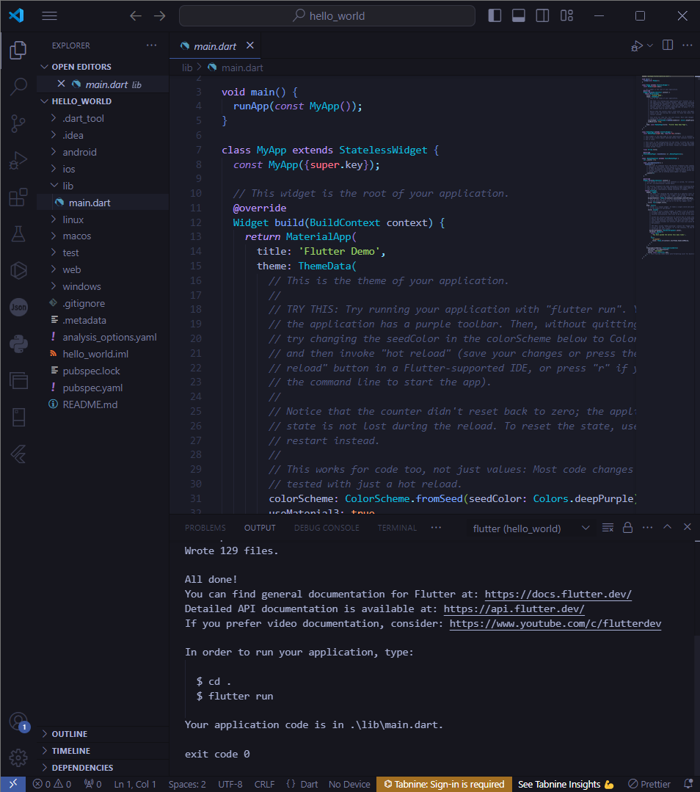
)

Disini, pada saat setelah kita menamai project kita, maka akan muncul Your Flutter project is ready di pojok kanan bawah, yang dimana itu artinya kita telah berhasil membuat project baru.

### Praktikum 2 : Membuat Repository GitHub dan Laporan Praktikum

Melanjutkan dari praktikum 1, silakan selesaikan langkah-langkah berikut ini.

**Perhatian:** Diasumsikan Anda telah mempunyai akun GitHub dan Anda telah memahami konsep dasar dalam bekerja menggunakan Git pada pertemuan pertama.

Praktikum ini dapat Anda **lewati langsung ke langkah 11** jika sudah paham cara membuat laporan praktikum sesuai style yang Anda pilih.

#### - Langkah 11 :

Kembali ke VS Code, ubah platform di pojok kanan bawah ke emulator atau device atau bisa juga menggunakan browser Chrome. Lalu coba running project **hello_world** dengan tekan **F5** atau **Run > Start Debugging**. Tunggu proses kompilasi hingga selesai, maka aplikasi flutter pertama Anda akan tampil seperti berikut.

**Jawab** :

(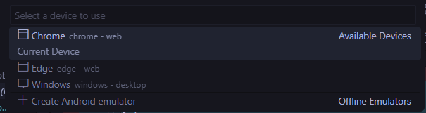
)

jadi disini, untuk yang pertama, saya memilih untuk menggunakan chrome sebagai device saya.

(.png>)
)

Disini, saya telah berhasil mernjalah proses run untuk pertama kalinya.

**Perhatian:** Proses Run atau kompilasi untuk pertama kali akan memakan waktu cukup lama (3-5 menit). Namun, proses kompilasi berikutnya menjadi lebih cepat. Berbeda ketika melakukan kompilasi ke device, hal ini akan memakan waktu lebih lama lagi.

#### - Langkah 12 :

Silakan screenshot seperti pada Langkah 11, namun teks yang ditampilkan dalam aplikasi berupa nama lengkap Anda. Simpan file screenshot dengan nama **01.png** pada folder **images** (buat folder baru jika belum ada) di project hello_world Anda. Lalu ubah isi README.md seperti berikut, sehingga tampil hasil screenshot pada file README.md. Kemudian push ke repository Anda.

**Jawab** :

(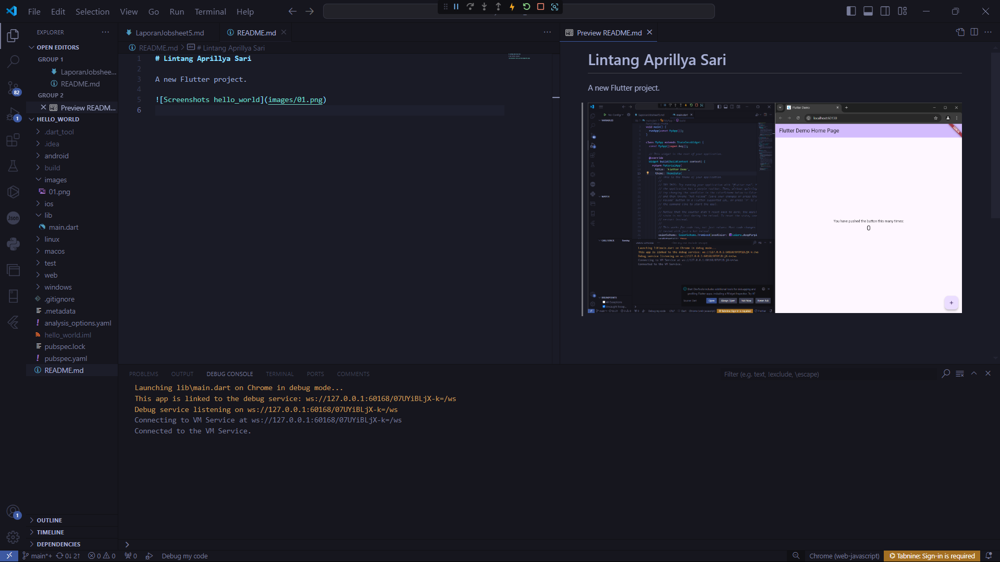
)

Disini, saya telah berhasil mengubah teks pada aplikasi yang awalnya hello_world menjadi nama lengkap saya.

**Perhatian:** Lakukan proses screenshot seperti pada Langkah 12 untuk setiap Laporan Praktikum yang Anda akan buat pada praktikum selanjutnya hingga pertemuan project final.

### Praktikum 3 : Menerapkan Widget Dasar

Selesaikan langkah-langkah praktikum berikut ini dengan melanjutkan dari praktikum sebelumnya.

#### - Langkah 1 : Text Widget

Buat folder baru **basic_widgets** di dalam folder **lib**. Kemudian buat file baru di dalam basic_widgets dengan nama text_widget.dart. Ketik atau salin kode program berikut ke project hello_world Anda pada file text_widget.dart.

**Jawab** :

(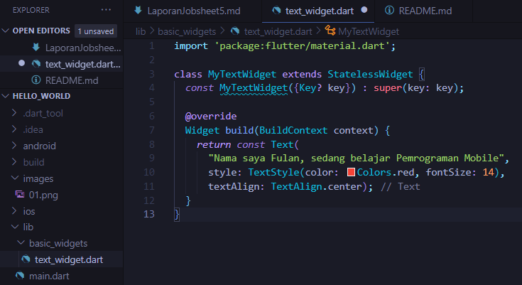
)

Disini, saya membuat folder baru di dalam lib dengan nama basic_widgets, lalu didalamnya saya membuat file baru dengan nama text_widget.dart yang lalu saya isikan filenya sesuai yang diminta.

(.png>)
)

Disini, saya telah mengimport file text_widget.dart ke main.dart, lalu setelah saya run, hasilnya seperti diatas.

**Perhatian:** Gantilah teks Fulan dengan nama lengkap Anda.

Lakukan import file text_widget.dart ke main.dart, lalu ganti bagian text widget dengan kode di atas. Maka hasilnya seperti gambar berikut. Screenshot hasil milik Anda, lalu dibuat laporan pada file README.md.

#### - Langkah 2 : Image Widget

Buat sebuah file image_widget.dart di dalam folder basic_widgets dengan isi kode berikut.

**Jawab** :

(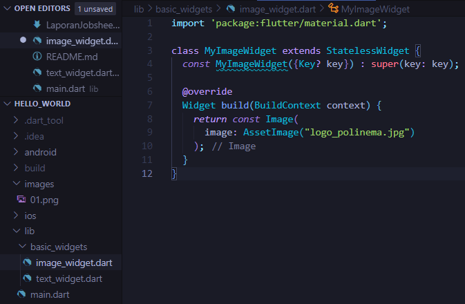
)

Disini, saya telah membuat file baru dengan nama image_Widget.dart dengan isi source code seperti di atas.

Lakukan penyesuaian asset pada file pubspec.yaml dan tambahkan file logo Anda di folder assets project hello_world.

**Jawab** :

(.png>)
)

Disini saya telah mengupload file di assets

Jangan lupa sesuaikan kode dan import di file main.dart kemudian akan tampil gambar seperti berikut.

**Jawab** :

(.png>)
)

Untuk main.dartnya juga sudah saya sesuaikan

(.png>)
)

(.png>)
)

Dengan mengubah beberapa source code dalam file semua sudah berhasil, dan hasil outputnya diatas

### Praktikum 4 : Menerapkan Widget Material Design dan iOS Cupertino

Selesaikan langkah-langkah praktikum berikut ini dengan melanjutkan project hello_world Anda. Lakukan langkah yang sama seperti pada Praktikum 3, yaitu setiap widget dibuat file sendiri lalu import ke main.dart dan screenshot hasilnya.

#### - Langkah 1 : Cupertino Button dan Loading Bar

Buat file di basic_widgets > loading_cupertino.dart. Import stateless widget dari material dan cupertino. Lalu isi kode di dalam method Widget build adalah sebagai berikut.

**Jawab** :

(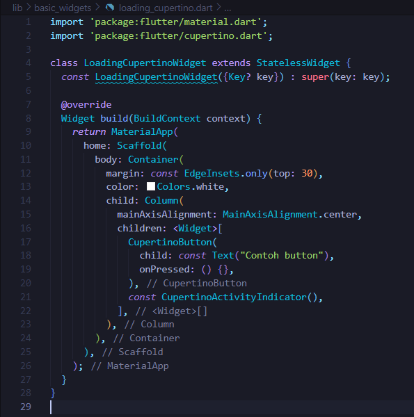
)

Disini saya telah menyesuaikan dengan melakukan import stateless widget

(.png>)
)

Di atas merupakan hasil output dari method loading

#### - Langkah 2 : Floating Action Button (FAB)

Button widget terdapat beberapa macam pada flutter yaitu ButtonBar, DropdownButton, TextButton, FloatingActionButton, IconButton, OutlineButton, PopupMenuButton, dan ElevatedButton.

Buat file di basic_widgets > fab_widget.dart. Import stateless widget dari material. Lalu isi kode di dalam method Widget build adalah sebagai berikut.

**Jawab** :

(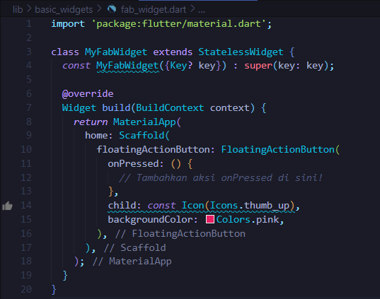
)

Disini, saya melakukan penyesuaian terhadap file fab_widget.dart

(.png>)
)

Disini dapat terlihat bahwa kita membuat button di pojok kanan bawah

#### - Langkah 3 : Scaffold Widget

Scaffold widget digunakan untuk mengatur tata letak sesuai dengan material design.

Ubah isi kode main.dart seperti berikut.

**Jawab** :

(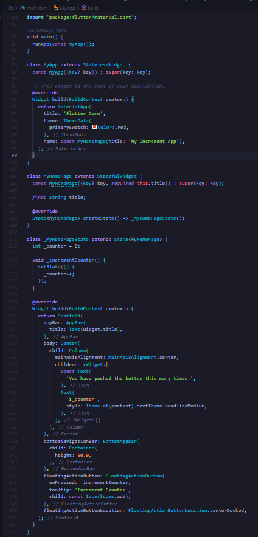
)

Saya mengubah file main seperti di atas

(.png>)
)

Lalu berikut merupakan hasil output dari scaffold widget. disini fungsinya adalah untuk membuat button counter.

#### - Langkah 4 : Dialog Widget

Dialog widget pada flutter memiliki dua jenis dialog yaitu AlertDialog dan SimpleDialog.

Ubah isi kode main.dart seperti berikut.

**Jawab** :

(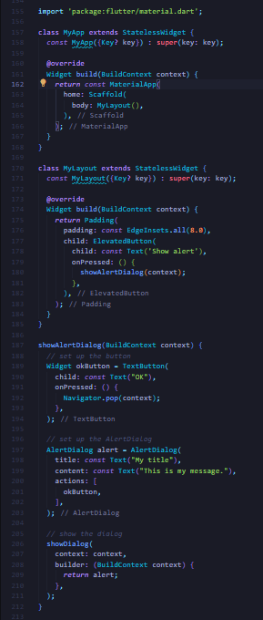
)

Disini, saya mengubah file main menjadi seperti diatas

(.png>)
)

Ini merupakah hasil output dari AlertDialog yang berfungsi untuk memberi tahu error yang ada pada kita

(.png>)
)

Ini merupakan pesan error yang ditampilkan.

#### - Langkah 5 : Input dan Selection Widget

Flutter menyediakan widget yang dapat menerima input dari pengguna aplikasi yaitu antara lain Checkbox, Date and Time Pickers, Radio Button, Slider, Switch, TextField.

Contoh penggunaan TextField widget adalah sebagai berikut:

**Jawab** :

(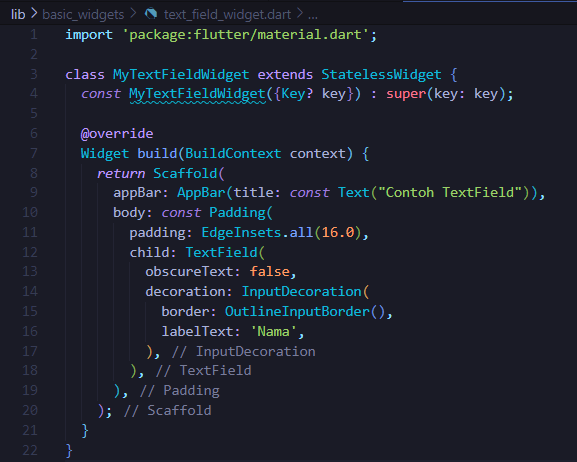
)

(.png>)
)

Disini, saya sudah membuat file sendiri untuk pembuatan textField yang berfungsi untuk membuat textBox.

#### - Langkah 6 : Date and Time Pickers

Date and Time Pickers termasuk pada kategori input dan selection widget, berikut adalah contoh penggunaan Date and Time Pickers.

**Jawab** :

(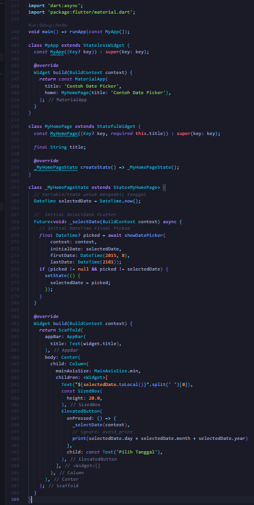
)

(.png>)
)

Disini kita dapat menggunakan Date Picker dengan baik dan sudah bisa berfungsi juga

### Tugas Praktikum

1. Selesaikan Praktikum 1 sampai 4, lalu dokumentasikan dan push ke repository Anda berupa screenshot setiap hasil pekerjaan beserta penjelasannya di file README.md!

2. Pada praktikum 4 mulai dari Langkah 3 sampai 6, buatlah file widget tersendiri di folder basic_widgets, kemudian pada file main.dart cukup melakukan import widget sesuai masing-masing langkah tersebut!

3. Selesaikan Codelabs: Your first Flutter app, lalu buatlah laporan praktikumnya dan push ke repository GitHub Anda!

4. README.md berisi: capture hasil akhir tiap praktikum (side-by-side, bisa juga berupa file GIF agar terlihat proses perubahan ketika ada aksi dari pengguna) di browser dan perangkat fisik (device) dengan menampilkan NIM dan Nama Anda sebagai ciri pekerjaan Anda. Jika mode developer di perangkat HP Anda belum aktif, silakan cari di internet cara mengaktifkannya!

5. Kumpulkan berupa link repository/commit GitHub Anda ke tautan spreadsheet yang telah disepakati oleh dosen!
