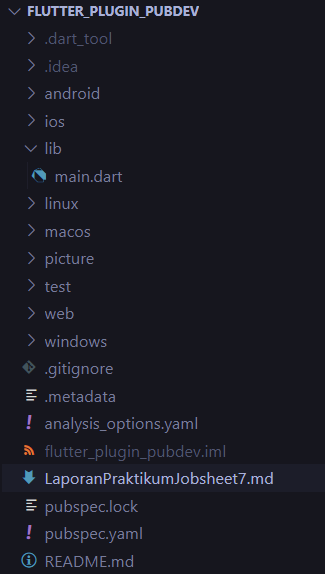
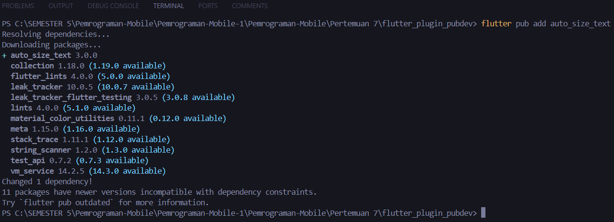
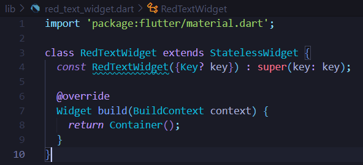
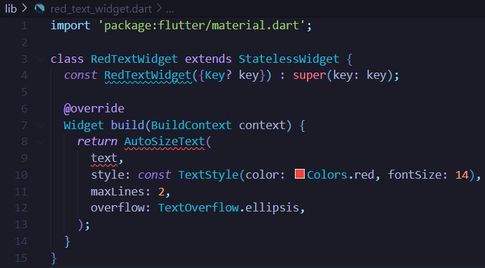
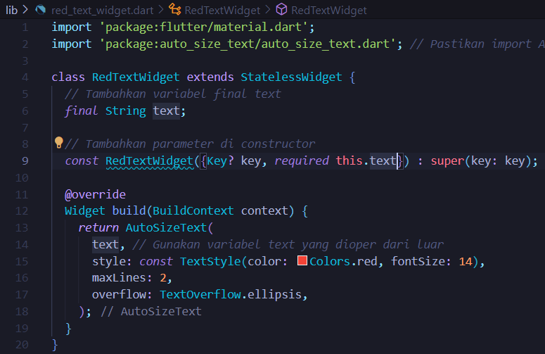
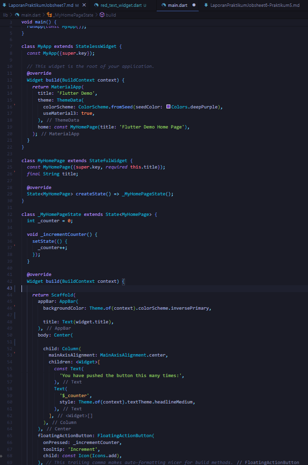
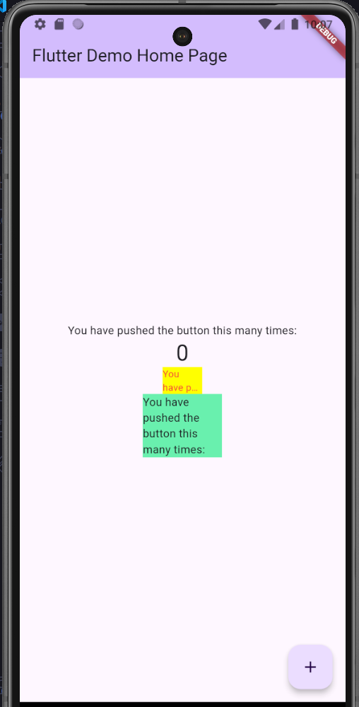

# Pemrograman Mobile

---

Nama : Lintang Aprillya Sari Sari

Kelas : 3C / 13

NIM : 2241720231

---

## Jobsheet 7 : Manajemen Plugin

### Praktikum Menerapkan Plugin di Project Flutter

#### > Langkah 1 : Buat Project Baru

    Buatlah sebuah project flutter baru dengan nama flutter_plugin_pubdev. Lalu jadikan repository di GitHub Anda dengan nama flutter_plugin_pubdev.

Jawab :

#### > Langkah 2 : Menambahkan Plugin

    Tambahkan plugin auto_size_text menggunakan perintah berikut di terminal

        flutter pub add auto_size_text

    Jika berhasil, maka akan tampil nama plugin beserta versinya di file pubspec.yaml pada bagian dependencies.

Jawab :

Pada pubspec.yaml akan muncul seperti berikut :

.png>)

#### > Langkah 3 : Buat File red_text_widget.dart

    Buat file baru bernama red_text_widget.dart di dalam folder lib lalu isi kode seperti berikut.

        import 'package:flutter/material.dart';

        class RedTextWidget extends StatelessWidget {
            const RedTextWidget({Key? key}) : super(key: key);

            @override
            Widget build(BuildContext context) {
                return Container();
            }
        }

Jawab :

#### > Langkah 4 : Tambah Widget AutoSizeText

    Masih di file red_text_widget.dart, untuk menggunakan plugin auto_size_text, ubahlah kode return Container() menjadi seperti berikut.

        return AutoSizeText(
            text,
            style: const TextStyle(color: Colors.red, fontSize: 14),
            maxLines: 2,
            overflow: TextOverflow.ellipsis,
        );

    Setelah Anda menambahkan kode di atas, Anda akan mendapatkan info error. Mengapa demikian? Jelaskan dalam laporan praktikum Anda!

Jawab :

Jadi, disini terjadi error karena dependency belum ditambahkan, karena Flutter tidak secara otomatis mengimpor atau menyediakan library eksternal. Karena itu, saat kita menambahkan widget AutoSizeText tanpa mengimpor package yang benar, maka akan terjadi error. Dan juga, disini kita belum melakukan import.

#### > Langkah 5 : Buat Variabel text dan parameter di constructor

    Tambahkan variabel text dan parameter di constructor seperti berikut.

        final String text;

        const RedTextWidget({Key? key, required this.text}) : super(key: key);

Jawab :

#### > Langkah 6 : Tambahkan widget di main.dart

    Buka file main.dart lalu tambahkan di dalam children: pada class _MyHomePageState

        Container(
            color: Colors.yellowAccent,
            width: 50,
            child: const RedTextWidget(
                    text: 'You have pushed the button this many times:',
                ),
        ),
        Container(
            color: Colors.greenAccent,
            width: 100,
            child: const Text(
                'You have pushed the button this many times:',
                ),
        ),

Jawab :

HASIL AKHIR :

Tugas Praktikum

1. Selesaikan Praktikum tersebut, lalu dokumentasikan dan push ke repository Anda berupa screenshot hasil pekerjaan beserta penjelasannya di file README.md!
2. Jelaskan maksud dari langkah 2 pada praktikum tersebut!
   Jawab :
   Maksud dari langkah 2 adalah untuk menambahkan plugin auto_size_text, memiliki tujuan untuk menambahkan dependensi eksternal yang diperlukan oleh aplikasi Flutter. Plugin ini tidak disertakan secara default dalam Flutter SDK, sehingga perlu ditambahkan secara manual ke dalam proyek agar dapat digunakan. Perintah flutter pub add auto_size_text yang dijalankan di terminal berfungsi untuk:

   - Menambahkan plugin ke proyek: Perintah ini secara otomatis mencari plugin auto_size_text di registry publik Flutter (pub.dev) dan menambahkannya ke file pubspec.yaml pada bagian dependencies. Plugin ini menyediakan widget AutoSizeText, yang memungkinkan teks secara otomatis menyesuaikan ukurannya agar sesuai dengan ruang yang tersedia.
   - Mengelola versi plugin: Perintah ini juga akan menambahkan versi terbaru yang kompatibel dari plugin. Anda dapat melihat nama plugin dan versinya tercantum di file pubspec.yaml, yang berfungsi sebagai daftar dependensi proyek Flutter.

3. Jelaskan maksud dari langkah 5 pada praktikum tersebut!

   Jawab :
   Pada Langkah 5, saya menambahkan variabel text dan parameter di constructor untuk membuat widget RedTextWidget lebih dinamis.

   - Variabel text:
     final String text; berfungsi menyimpan teks yang akan ditampilkan, dan nilainya tidak dapat diubah setelah diinisialisasi.
   - Parameter di constructor:
     required this.text memastikan teks wajib diisi saat widget dibuat. Ini memungkinkan widget menampilkan teks yang berbeda sesuai input.

4. Pada langkah 6 terdapat dua widget yang ditambahkan, jelaskan fungsi dan perbedaannya!

   Jawab :
   Intinya adalah :

   - Perbedaan utama: Widget pertama menggunakan AutoSizeText untuk otomatis menyesuaikan ukuran teks sesuai ruang, sementara widget kedua menggunakan teks statis yang tidak berubah ukurannya meskipun ruang terbatas.
   - Fungsi: Keduanya menampilkan teks, tetapi widget pertama lebih fleksibel dalam menangani teks panjang dalam ruang yang sempit dengan pemotongan otomatis jika diperlukan.

5. Jelaskan maksud dari tiap parameter yang ada di dalam plugin auto_size_text berdasarkan tautan pada dokumentasi ini !
   Jawab :
   - key (wajib): Mengontrol bagaimana satu widget menggantikan widget lain dalam struktur widget.
   - textKey: Menentukan kunci untuk widget Text yang dihasilkan.
   - style (wajib): Gaya yang akan digunakan untuk teks ini. Jika tidak diisi, akan menggunakan gaya default.
   - minFontSize: Ukuran teks minimum yang akan dipakai saat menyesuaikan ukuran teks secara otomatis. Ini diabaikan jika presetFontSizes diatur.
   - maxFontSize: Ukuran teks maksimum yang akan dipakai saat menyesuaikan ukuran teks secara otomatis. Ini diabaikan jika presetFontSizes diatur.
   - stepGranularity: Ukuran langkah untuk menyesuaikan ukuran font sesuai dengan batasan.
   - presetFontSizes: Menentukan semua ukuran font yang mungkin digunakan. Penting: ukuran harus diurutkan dari yang terbesar ke yang terkecil.
   - group: Menyinkronkan ukuran beberapa AutoSizeText agar sama.
   - textAlign (wajib): Menentukan bagaimana teks harus diatur secara horizontal (misalnya, rata kiri, rata tengah, rata kanan).
   - textDirection (wajib): Menentukan arah teks, yang mempengaruhi cara nilai textAlign seperti TextAlign.start dan TextAlign.end diinterpretasikan.
   - locale: Digunakan untuk memilih font ketika karakter Unicode yang sama dapat ditampilkan berbeda tergantung pada lokasi.
   - softWrap: Menentukan apakah teks harus terputus di pemisah baris lunak (soft line breaks).
   - wrapWords: Menentukan apakah kata yang tidak muat dalam satu baris harus dibungkus ke baris berikutnya. Secara default, ini akan berperilaku seperti widget Text.
   - overflow: Menentukan bagaimana overflow visual (teks yang keluar dari batas) harus ditangani.
   - overflowReplacement: Jika teks melampaui batas dan tidak muat, widget ini akan ditampilkan sebagai pengganti.
   - textScaleFactor (wajib): Menentukan jumlah piksel font untuk setiap piksel logis. Ini juga mempengaruhi minFontSize, maxFontSize, dan presetFontSizes.
   - maxLines: Jumlah maksimum baris yang diizinkan untuk teks.
   - semanticsLabel (wajib): Label alternatif untuk teks ini, yang digunakan untuk tujuan aksesibilitas.
6. Kumpulkan laporan praktikum Anda berupa link repository GitHub kepada dosen!
