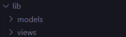
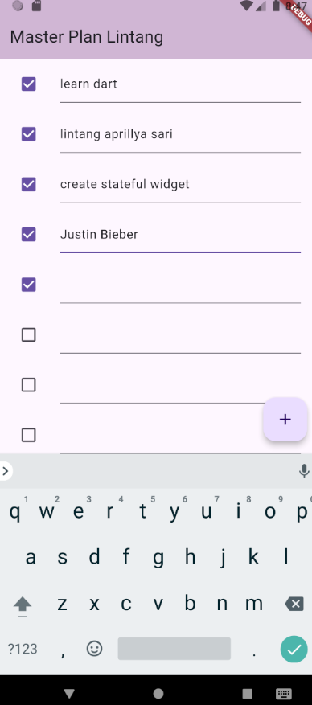
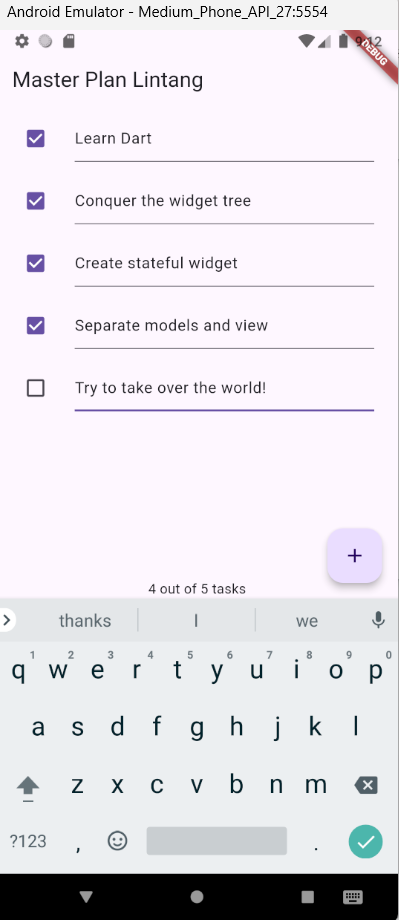
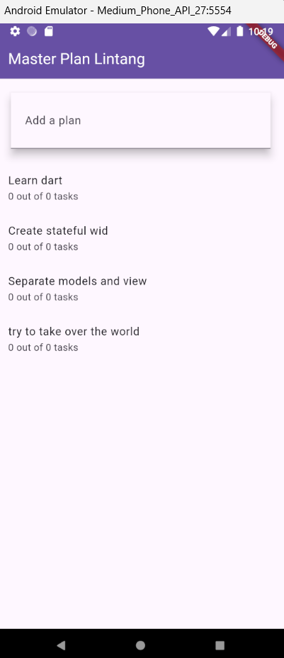

# Pemrograman Mobile

---

Nama : Lintang Aprillya Sari Sari

Kelas : 3C / 13

NIM : 2241720231

---

## Jobsheet 10 : Dasar State Management

### Praktikum 1 : Dasar State dengan Model-View

#### > Langkah 1 : Buat Project Baru

Buatlah sebuah project flutter baru dengan nama master_plan di folder src week-11 repository GitHub Anda. Lalu buatlah susunan folder dalam project seperti gambar berikut ini.

#### > Langkah 2 : Membuat model task.dart

Praktik terbaik untuk memulai adalah pada lapisan data (data layer). Ini akan memberi Anda gambaran yang jelas tentang aplikasi Anda, tanpa masuk ke detail antarmuka pengguna Anda. Di folder model, buat file bernama task.dart dan buat class Task. Class ini memiliki atribut description dengan tipe data String dan complete dengan tipe data Boolean, serta ada konstruktor. Kelas ini akan menyimpan data tugas untuk aplikasi kita. Tambahkan kode berikut:

        class Task {
            final String description;
            final bool complete;

            const Task({
                this.complete = false,
                this.description = '',
            });
        }

#### > Langkah 3 : Buat file plan.dart

Kita juga perlu sebuah List untuk menyimpan daftar rencana dalam aplikasi to-do ini. Buat file plan.dart di dalam folder models dan isi kode seperti berikut.

    import './task.dart';

    class Plan {
        final String name;
        final List<Task> tasks;

        const Plan({this.name = '', this.tasks = const []});
    }

#### > Langkah 4 : Buat file data_layer.dart

Kita dapat membungkus beberapa data layer ke dalam sebuah file yang nanti akan mengekspor kedua model tersebut. Dengan begitu, proses impor akan lebih ringkas seiring berkembangnya aplikasi. Buat file bernama data_layer.dart di folder models. Kodenya hanya berisi export seperti berikut.

    export 'plan.dart';
    export 'task.dart';

#### > Langkah 5 : Pindah ke file main.dart

Ubah isi kode main.dart sebagai berikut.

    import 'package:flutter/material.dart';
    import './views/plan_screen.dart';

    void main() => runApp(MasterPlanApp());

    class MasterPlanApp extends StatelessWidget {
        const MasterPlanApp({super.key});

        @override
        Widget build(BuildContext context) {
            return MaterialApp(
                theme: ThemeData(primarySwatch: Colors.purple),
                home: PlanScreen(),
            );
        }
    }

#### > Langkah 6 : buat plan_screen.dart

Pada folder views, buatlah sebuah file plan_screen.dart dan gunakan templat StatefulWidget untuk membuat class PlanScreen. Isi kodenya adalah sebagai berikut. Gantilah teks ‘Namaku' dengan nama panggilan Anda pada title AppBar.

    import '../models/data_layer.dart';
    import 'package:flutter/material.dart';

    class PlanScreen extends StatefulWidget {
        const PlanScreen({super.key});

        @override
        State createState() => _PlanScreenState();
    }

    class _PlanScreenState extends State<PlanScreen> {
        Plan plan = const Plan();

        @override
        Widget build(BuildContext context) {
            return Scaffold(
                // ganti ‘Namaku' dengan Nama panggilan Anda
                appBar: AppBar(title: const Text('Master Plan Namaku')),
                body: _buildList(),
                floatingActionButton: _buildAddTaskButton(),
            );
        }
    }

#### > Langkah 7 : buat method buildAddTaskButton()

Anda akan melihat beberapa error di langkah 6, karena method yang belum dibuat. Ayo kita buat mulai dari yang paling mudah yaitu tombol Tambah Rencana. Tambah kode berikut di bawah method build di dalam class PlanScreenState.

    Widget _buildAddTaskButton() {
        return FloatingActionButton(
            child: const Icon(Icons.add),
            onPressed: () {
                setState(() {
                    plan = Plan(
                        name: plan.name,
                        tasks: List<Task>.from(plan.tasks)
                        ..add(const Task()),
                    );
                });
            },
        );
    }

#### > Langkah 8 : buat widget \_buildList()

Kita akan buat widget berupa List yang dapat dilakukan scroll, yaitu ListView.builder. Buat widget ListView seperti kode berikut ini.

    Widget _buildList() {
        return ListView.builder(
            itemCount: plan.tasks.length,
            itemBuilder: (context, index) =>
            _buildTaskTile(plan.tasks[index], index),
        );
    }

#### > Langkah 9 : buat widget \_buildTaskTile

Dari langkah 8, kita butuh ListTile untuk menampilkan setiap nilai dari plan.tasks. Kita buat dinamis untuk setiap index data, sehingga membuat view menjadi lebih mudah. Tambahkan kode berikut ini.

    Widget _buildTaskTile(Task task, int index) {
        return ListTile(
        leading: Checkbox(
            value: task.complete,
            onChanged: (selected) {
                setState(() {
                plan = Plan(
                    name: plan.name,
                    tasks: List<Task>.from(plan.tasks)
                    ..[index] = Task(
                        description: task.description,
                        complete: selected ?? false,
                    ),
                );
                });
            }),
        title: TextFormField(
            initialValue: task.description,
            onChanged: (text) {
            setState(() {
                plan = Plan(
                name: plan.name,
                tasks: List<Task>.from(plan.tasks)
                    ..[index] = Task(
                    description: text,
                    complete: task.complete,
                    ),
                );
            });
            },
        ),
        );
    }

Run atau tekan F5 untuk melihat hasil aplikasi yang Anda telah buat. Capture hasilnya untuk soal praktikum nomor 4.

#### > Langkah 10 : Tambah Scroll Controller

Anda dapat menambah tugas sebanyak-banyaknya, menandainya jika sudah beres, dan melakukan scroll jika sudah semakin banyak isinya. Namun, ada salah satu fitur tertentu di iOS perlu kita tambahkan. Ketika keyboard tampil, Anda akan kesulitan untuk mengisi yang paling bawah. Untuk mengatasi itu, Anda dapat menggunakan ScrollController untuk menghapus focus dari semua TextField selama event scroll dilakukan. Pada file plan_screen.dart, tambahkan variabel scroll controller di class State tepat setelah variabel plan.

    late ScrollController scrollController;

#### > Langkah 11 : Tambah Scroll Listener

Tambahkan method initState() setelah deklarasi variabel scrollController seperti kode berikut.

    @override
    void initState() {
    super.initState();
    scrollController = ScrollController()
        ..addListener(() {
        FocusScope.of(context).requestFocus(FocusNode());
        });
    }

#### > Langkah 12 : Tambah controller dan keyboard behavior

Tambahkan controller dan keyboard behavior pada ListView di method \_buildList seperti kode berikut ini.

    return ListView.builder(
    controller: scrollController,
    keyboardDismissBehavior: Theme.of(context).platform ==
    TargetPlatform.iOS
            ? ScrollViewKeyboardDismissBehavior.onDrag
            : ScrollViewKeyboardDismissBehavior.manual,
    )

#### > Langkah 13 : Terakhir, tambah method dispose()

Terakhir, tambahkan method dispose() berguna ketika widget sudah tidak digunakan lagi.

    @override
    void dispose() {
    scrollController.dispose();
    super.dispose();
    }

#### > Langkah 14 : Hasil

Lakukan Hot restart (bukan hot reload) pada aplikasi Flutter Anda. Anda akan melihat tampilan akhir seperti gambar berikut. Jika masih terdapat error, silakan diperbaiki hingga bisa running.

### Tugas Praktikum 1 : Dasar State dengan Model-View

#### > 1. Selesaikan langkah-langkah praktikum tersebut, lalu dokumentasikan berupa GIF hasil akhir praktikum beserta penjelasannya di file README.md! Jika Anda menemukan ada yang error atau tidak berjalan dengan baik, silakan diperbaiki.

Jawab :

#### > 2. Jelaskan maksud dari langkah 4 pada praktikum tersebut! Mengapa dilakukan demikian?

Jawab :

Langkah 4 dalam praktikum ini melibatkan pembuatan file data_layer.dart untuk mengorganisasi dan menyederhanakan proses impor model dalam aplikasi. Dengan mengekspor kedua model, yaitu plan.dart dan task.dart, melalui satu file ini, pengelolaan struktur kode menjadi lebih teratur dan ringkas. Hal ini sangat berguna ketika aplikasi berkembang, karena memudahkan pengembang dalam mengimpor model-model tersebut tanpa harus menulis beberapa baris impor di setiap file yang membutuhkannya, sehingga meningkatkan keterbacaan dan efisiensi kode.

#### > 3. Mengapa perlu variabel plan di langkah 6 pada praktikum tersebut? Mengapa dibuat konstanta ?

Jawab :

Variabel plan di langkah 6 pada praktikum tersebut diperlukan untuk menyimpan dan mengelola data terkait rencana (task) dalam aplikasi. Dengan variabel ini, aplikasi dapat mengakses informasi mengenai nama dan daftar tugas yang terdapat dalam Plan, yang merupakan model data yang telah didefinisikan sebelumnya.

Dibuatnya variabel plan sebagai konstanta (const Plan()) memungkinkan untuk memastikan bahwa instansiasi awal dari objek Plan tidak akan berubah setelah dibuat. Ini berarti bahwa ketika Plan dibuat, data yang disimpan di dalamnya bersifat tetap dan tidak dapat dimodifikasi, kecuali melalui mekanisme yang disediakan dalam aplikasi (misalnya, dengan menambah atau mengubah tugas). Dengan menggunakan konstanta, ini juga dapat membantu mengurangi kemungkinan kesalahan yang dapat terjadi akibat modifikasi tidak disengaja pada objek tersebut, serta memberikan kejelasan bahwa objek ini memiliki keadaan awal yang tetap.

#### > 4. Lakukan capture hasil dari Langkah 9 berupa GIF, kemudian jelaskan apa yang telah Anda buat!

Jawab :

langkah sembilan kita membuat \_buildTaskFile, yaitu sebuah widget yang akan digunakan sebagai template task yang bersifat dinamis tergantung dari data yang ditampilkan. Widget ini menggunakan ListTile dimana terdapat checkbox pada leading ListTile, dan TextFormField untuk titlenya. Widget ini nantinya akan dipanggil pada widget \_buildList, dan akan dilooping sebanyak data yang ada.

#### > 5. Apa kegunaan method pada Langkah 11 dan 13 dalam lifecyle state ?

Jawab :

Pada langkah 11, method initState() digunakan untuk menginisialisasi variabel scrollController saat widget pertama kali dibuat. Dalam konteks lifecycle state, initState() adalah titik awal di mana konfigurasi yang memerlukan konteks (seperti menambahkan listener) dilakukan. Dalam hal ini, listener ditambahkan untuk menghapus fokus dari semua TextField ketika pengguna menggulir daftar. Ini berguna untuk memastikan bahwa keyboard tidak menghalangi tampilan pengguna saat mereka ingin berinteraksi dengan item di bagian bawah daftar.

Sementara itu, pada langkah 13, method dispose() berfungsi untuk membersihkan sumber daya yang digunakan oleh scrollController ketika widget tidak lagi diperlukan. Dalam lifecycle state, dispose() dipanggil sebelum widget dihapus dari tree dan merupakan tempat yang tepat untuk melepaskan sumber daya seperti controller, listeners, dan event handlers. Ini penting untuk menghindari kebocoran memori, karena jika sumber daya tidak dibersihkan, aplikasi dapat mengalami penurunan kinerja seiring waktu. Dengan demikian, kedua method ini berperan penting dalam mengelola siklus hidup widget dengan baik dan menjaga efisiensi aplikasi.

#### > 6. Kumpulkan laporan praktikum Anda berupa link commit atau repository GitHub ke spreadsheet yang telah disediakan!

### Praktikum 2 : Mengelola Data Layer dengan InheritedWidget dan InheritedNotifier

#### > Langkah 1 : Buat file plan_provider.dart

Buat folder baru provider di dalam folder lib, lalu buat file baru dengan nama plan_provider.dart berisi kode seperti berikut.

    import 'package:flutter/material.dart';
    import '../models/data_layer.dart';

    class PlanProvider extends InheritedNotifier<ValueNotifier<Plan>> {
        const PlanProvider({super.key, required Widget child, required
        ValueNotifier<Plan> notifier})
        : super(child: child, notifier: notifier);

        static ValueNotifier<Plan> of(BuildContext context) {
            return context.
                dependOnInheritedWidgetOfExactType<PlanProvider>()!.notifier!;
        }
    }

#### > Langkah 2 : Edit main.dart

Gantilah pada bagian atribut home dengan PlanProvider seperti berikut. Jangan lupa sesuaikan bagian impor jika dibutuhkan.

    return MaterialApp(
        theme: ThemeData(primarySwatch: Colors.purple),
        home: PlanProvider(
            notifier: ValueNotifier<Plan>(const Plan()),
            child: const PlanScreen(),
        ),
    );

#### > Langkah 3 : Tambah method pada model plan.dart

Tambahkan dua method di dalam model class Plan seperti kode berikut.

    int get completedCount => tasks
        .where((task) => task.complete)
        .length;

    String get completenessMessage =>
        '$completedCount out of ${tasks.length} tasks';

#### > Langkah 4 : Pindah ke PlanScreen

Edit PlanScreen agar menggunakan data dari PlanProvider. Hapus deklarasi variabel plan (ini akan membuat error). Kita akan perbaiki pada langkah 5 berikut ini.

#### > Langkah 5 : Edit method \_buildAddTaskButton

Tambahkan BuildContext sebagai parameter dan gunakan PlanProvider sebagai sumber datanya. Edit bagian kode seperti berikut.

    Widget _buildAddTaskButton(BuildContext context) {
        ValueNotifier<Plan> planNotifier = PlanProvider.of(context);
        return FloatingActionButton(
            child: const Icon(Icons.add),
            onPressed: () {
            Plan currentPlan = planNotifier.value;
            planNotifier.value = Plan(
                name: currentPlan.name,
                tasks: List<Task>.from(currentPlan.tasks)..add(const Task()),
            );
            },
        );
    }

#### > Langkah 6 : Edit method \_buildTaskTile

Tambahkan parameter BuildContext, gunakan PlanProvider sebagai sumber data. Ganti TextField menjadi TextFormField untuk membuat inisial data provider menjadi lebih mudah.

    Widget _buildTaskTile(Task task, int index, BuildContext context) {
        ValueNotifier<Plan> planNotifier = PlanProvider.of(context);
        return ListTile(
            leading: Checkbox(
            value: task.complete,
            onChanged: (selected) {
                Plan currentPlan = planNotifier.value;
                planNotifier.value = Plan(
                name: currentPlan.name,
                tasks: List<Task>.from(currentPlan.tasks)
                    ..[index] = Task(
                    description: task.description,
                    complete: selected ?? false,
                    ),
                );
            }),
            title: TextFormField(
                initialValue: task.description,
                onChanged: (text) {
                    Plan currentPlan = planNotifier.value;
                    planNotifier.value = Plan(
                    name: currentPlan.name,
                    tasks: List<Task>.from(currentPlan.tasks)
                        ..[index] = Task(
                        description: text,
                        complete: task.complete,
                        ),
                    );
                },
            ),
        );
    }

#### > Langkah 7 : Edit \_buildList

Sesuaikan parameter pada bagian \_buildTaskTile seperti kode berikut.

    Widget _buildList(Plan plan) {
        return ListView.builder(
            controller: scrollController,
            itemCount: plan.tasks.length,
            itemBuilder: (context, index) =>
                _buildTaskTile(plan.tasks[index], index, context),
        );
    }

#### > Langkah 8 : Tetap di class PlanScreen

Edit method build sehingga bisa tampil progress pada bagian bawah (footer). Caranya, bungkus (wrap) \_buildList dengan widget Expanded dan masukkan ke dalam widget Column seperti kode pada Langkah 9.

#### > Langkah 9 : Tambah widget SafeArea

Terakhir, tambahkan widget SafeArea dengan berisi completenessMessage pada akhir widget Column. Perhatikan kode berikut ini.

    @override
    Widget build(BuildContext context) {
        return Scaffold(
            appBar: AppBar(title: const Text('Master Plan')),
            body: ValueListenableBuilder<Plan>(
                valueListenable: PlanProvider.of(context),
                builder: (context, plan, child) {
                    return Column(
                        children: [
                            Expanded(child: _buildList(plan)),
                            SafeArea(child: Text(plan.completenessMessage))
                        ],
                    );
                },
            ),
            floatingActionButton: _buildAddTaskButton(context),
        );
    }

Akhirnya, run atau tekan F5 jika aplikasi belum running. Tidak akan terlihat perubahan pada UI, namun dengan melakukan langkah-langkah di atas, Anda telah menerapkan cara memisahkan dengan baik antara view dan model. Ini merupakan hal terpenting dalam mengelola state di aplikasi Anda.

Jawab :

### Tugas Praktikum 2 : InheritedWidget

#### > 1. Selesaikan langkah-langkah praktikum tersebut, lalu dokumentasikan berupa GIF hasil akhir praktikum beserta penjelasannya di file README.md! Jika Anda menemukan ada yang error atau tidak berjalan dengan baik, silakan diperbaiki sesuai dengan tujuan aplikasi tersebut dibuat.

#### > 2. Jelaskan mana yang dimaksud InheritedWidget pada langkah 1 tersebut! Mengapa yang digunakan InheritedNotifier?

Jawab :

InheritedWidget adalah sebuah widget yang memungkinkan data untuk diteruskan ke widget turunannya dalam pohon widget. Hal ini memudahkan komunikasi antara bagian-bagian aplikasi yang memerlukan akses ke data tertentu tanpa perlu mengoper data melalui constructor dari widget ke widget secara berulang. Dalam praktikum ini, InheritedNotifier digunakan karena ia adalah turunan dari InheritedWidget yang dapat memberi tahu widget yang bergantung padanya ketika data di dalamnya berubah. Dengan menggunakan InheritedNotifier, perubahan pada data dapat direspons secara otomatis oleh widget yang memerlukan data tersebut, sehingga menjadikan aplikasi lebih reaktif dan efisien.

#### > 3. Jelaskan maksud dari method di langkah 3 pada praktikum tersebut! Mengapa dilakukan demikian?

Jawab :

Pada langkah 3, ditambahkan dua method dalam class Plan untuk menghitung jumlah tugas yang telah diselesaikan dan untuk menghasilkan pesan mengenai kelengkapan tugas. Method ini bertujuan untuk memudahkan pengelolaan dan penyajian data terkait status tugas dalam aplikasi. Dengan menambahkan method ini, aplikasi dapat dengan mudah menampilkan berapa banyak tugas yang telah diselesaikan dibandingkan dengan total tugas yang ada, yang penting untuk memberikan umpan balik visual kepada pengguna tentang kemajuan mereka.

#### > 4. Lakukan capture hasil dari Langkah 9 berupa GIF, kemudian jelaskan apa yang telah Anda buat!

Jawab :

Ketika user menambahkan Task, maka akan muncul ListTile baru, namun task selesai masih bernilai 0 dari keseluruhan task. Ketika salah satu task diklik checkboxnya menjadi true, maka comnpleted task akan bertambah.

Dalam langkah 9, footer aplikasi ditambahkan menggunakan widget SafeArea yang menampilkan pesan kelengkapan tugas dari model Plan. Dengan demikian, pengguna dapat dengan mudah melihat progres mereka terhadap tugas yang telah mereka buat, meningkatkan interaksi dan kepuasan pengguna.

#### > 5. Kumpulkan laporan praktikum Anda berupa link commit atau repository GitHub ke spreadsheet yang telah disediakan!

### Praktikum 3 : Membuat State di Multiple Screens

#### > Langkah 1 : Edit PlanProvider

Perhatikan kode berikut, edit class PlanProvider sehingga dapat menangani List Plan.

    class PlanProvider extends
    InheritedNotifier<ValueNotifier<List<Plan>>> {
        const PlanProvider({super.key, required Widget child, required
    ValueNotifier<List<Plan>> notifier})
        : super(child: child, notifier: notifier);

        static ValueNotifier<List<Plan>> of(BuildContext context) {
            return context.
            dependOnInheritedWidgetOfExactType<PlanProvider>()!.notifier!;
        }
    }

#### > Langkah 2: Edit main.dart

Langkah sebelumnya dapat menyebabkan error pada main.dart dan plan_screen.dart. Pada method build, gantilah menjadi kode seperti ini.

    @override
    Widget build(BuildContext context) {
        return PlanProvider(
            notifier: ValueNotifier<List<Plan>>(const []),
            child: MaterialApp(
                title: 'State management app',
                theme: ThemeData(
                    primarySwatch: Colors.blue,
                ),
                home: const PlanScreen(),
            ),
        );
    }

#### > Langkah 3 : Edit plan_screen.dart

Tambahkan variabel plan dan atribut pada constructor-nya seperti berikut.

    final Plan plan;
    const PlanScreen({super.key, required this.plan});

#### > Langkah 4 : Error

Itu akan terjadi error setiap kali memanggil PlanProvider.of(context). Itu terjadi karena screen saat ini hanya menerima tugas-tugas untuk satu kelompok Plan, tapi sekarang PlanProvider menjadi list dari objek plan tersebut.

#### > Langkah 5 : Tambah getter Plan

Tambahkan getter pada \_PlanScreenState seperti kode berikut.

    class _PlanScreenState extends State<PlanScreen> {
        late ScrollController scrollController;
        Plan get plan => widget.plan;

#### > Langkah 6 : Method initState()

Pada bagian ini kode tetap seperti berikut.

    @override
    void initState() {
        super.initState();
        scrollController = ScrollController()
            ..addListener(() {
            FocusScope.of(context).requestFocus(FocusNode());
            });
    }

#### > Langkah 7: Widget build

Pastikan Anda telah merubah ke List dan mengubah nilai pada currentPlan seperti kode berikut ini.

    @override
    Widget build(BuildContext context) {
        ValueNotifier<List<Plan>> plansNotifier = PlanProvider.of(context);

        return Scaffold(
        appBar: AppBar(title: Text(_plan.name)),
        body: ValueListenableBuilder<List<Plan>>(
            valueListenable: plansNotifier,
            builder: (context, plans, child) {
            Plan currentPlan = plans.firstWhere((p) => p.name == plan.
    name);
            return Column(
                children: [
                Expanded(child: _buildList(currentPlan)),
                SafeArea(child: Text(currentPlan.
    completenessMessage)),
                ],);},),
        floatingActionButton: _buildAddTaskButton(context,)
    ,);
    }

    Widget _buildAddTaskButton(BuildContext context) {
        ValueNotifier<List<Plan>> planNotifier = PlanProvider.
    of(context);
        return FloatingActionButton(
        child: const Icon(Icons.add),
        onPressed: () {
            Plan currentPlan = plan;
            int planIndex =
                planNotifier.value.indexWhere((p) => p.name == currentPlan.name);
            List<Task> updatedTasks = List<Task>.from(currentPlan.tasks)
            ..add(const Task());
            planNotifier.value = List<Plan>.from(planNotifier.value)
            ..[planIndex] = Plan(
                name: currentPlan.name,
                tasks: updatedTasks,
            );
            plan = Plan(
            name: currentPlan.name,
            tasks: updatedTasks,
            );},);
    }

#### > Langkah 8 : Edit \_buildTaskTile

Pastikan ubah ke List dan variabel planNotifier seperti kode berikut ini.

    Widget _buildTaskTile(Task task, int index, BuildContext context)
    {
        ValueNotifier<List<Plan>> planNotifier = PlanProvider.
    of(context);

        return ListTile(
        leading: Checkbox(
            value: task.complete,
            onChanged: (selected) {
            Plan currentPlan = plan;
            int planIndex = planNotifier.value
                .indexWhere((p) => p.name == currentPlan.name);
            planNotifier.value = List<Plan>.from(planNotifier.value)
                ..[planIndex] = Plan(
                name: currentPlan.name,
                tasks: List<Task>.from(currentPlan.tasks)
                    ..[index] = Task(
                    description: task.description,
                    complete: selected ?? false,
                    ),);
            }),
        title: TextFormField(
            initialValue: task.description,
            onChanged: (text) {
            Plan currentPlan = plan;
            int planIndex =
                planNotifier.value.indexWhere((p) => p.name ==
    currentPlan.name);
            planNotifier.value = List<Plan>.from(planNotifier.value)
                ..[planIndex] = Plan(
                name: currentPlan.name,
                tasks: List<Task>.from(currentPlan.tasks)
                    ..[index] = Task(
                    description: text,
                    complete: task.complete,
                    ),
                );
    },),);}

#### > Langkah 9 : Buat screen baru

Pada folder view, buatlah file baru dengan nama plan_creator_screen.dart dan deklarasikan dengan StatefulWidget bernama PlanCreatorScreen. Gantilah di main.dart pada atribut home menjadi seperti berikut.

    home: const PlanCreatorScreen(),

#### > Langkah 10 : Pindah ke class \_PlanCreatorScreenState

Kita perlu tambahkan variabel TextEditingController sehingga bisa membuat TextField sederhana untuk menambah Plan baru. Jangan lupa tambahkan dispose ketika widget unmounted seperti kode berikut.

    final textController = TextEditingController();

    @override
    void dispose() {
        textController.dispose();
        super.dispose();
    }

#### > Langkah 11 : Pindah ke method build

Letakkan method Widget build berikut di atas void dispose. Gantilah ‘Namaku' dengan nama panggilan Anda.

    @override
    Widget build(BuildContext context) {
        return Scaffold(
            // ganti ‘Namaku' dengan nama panggilan Anda
            appBar: AppBar(title: const Text('Master Plans Namaku')),
            body: Column(children: [
                _buildListCreator(),
                Expanded(child: _buildMasterPlans())
            ]),
        );
    }

#### > Langkah 12 : Buat widget \_buildListCreator

Buatlah widget berikut setelah widget build.

    Widget _buildListCreator() {
        return Padding(
            padding: const EdgeInsets.all(20.0),
            child: Material(
                color: Theme.of(context).cardColor,
                elevation: 10,
                child: TextField(
                    controller: textController,
                    decoration: const InputDecoration(
                        labelText: 'Add a plan',
                        contentPadding: EdgeInsets.all(20)),
                    onEditingComplete: addPlan),
            ));
    }

#### > Langkah 13 : Buat void addPlan()

Tambahkan method berikut untuk menerima inputan dari user berupa text plan.

    void addPlan() {
    final text = textController.text;
        if (text.isEmpty) {
            return;
        }
        final plan = Plan(name: text, tasks: []);
        ValueNotifier<List<Plan>> planNotifier =
    PlanProvider.of(context);
        planNotifier.value = List<Plan>.from(planNotifier.value)..
    add(plan);
        textController.clear();
        FocusScope.of(context).requestFocus(FocusNode());
        setState(() {});
    }

#### > angkah 14 : Buat widget \_buildMasterPlans()

Tambahkan widget seperti kode berikut.

    Widget \_buildMasterPlans() {
    ValueNotifier<List<Plan>> planNotifier = PlanProvider.of(context);
    List<Plan> plans = planNotifier.value;

        if (plans.isEmpty) {
        return Column(
            mainAxisAlignment: MainAxisAlignment.center,
            children: <Widget>[
            const Icon(Icons.note, size: 100, color: Colors.grey),
            Text('Anda belum memiliki rencana apapun.',
                style: Theme.of(context).textTheme.headlineSmall)
            ]);
        }
        return ListView.builder(
            itemCount: plans.length,
            itemBuilder: (context, index) {
            final plan = plans[index];
            return ListTile(
                title: Text(plan.name),
                subtitle: Text(plan.completenessMessage),
                onTap: () {
                    Navigator.of(context).push(
                    MaterialPageRoute(builder: (_) =>

    PlanScreen(plan: plan,)));
    });
    });
    }

Terakhir, run atau tekan F5 untuk melihat hasilnya jika memang belum running. Bisa juga lakukan hot restart jika aplikasi sudah running. Maka hasilnya akan seperti gambar berikut ini.

Jawab :

### Tugas Praktikum 3 : State di Multiple Screens

#### > 1. Selesaikan langkah-langkah praktikum tersebut, lalu dokumentasikan berupa GIF hasil akhir praktikum beserta penjelasannya di file README.md! Jika Anda menemukan ada yang error atau tidak berjalan dengan baik, silakan diperbaiki sesuai dengan tujuan aplikasi tersebut dibuat.

Jawab :

#### > 2. Berdasarkan Praktikum 3 yang telah Anda lakukan, jelaskan maksud dari gambar diagram berikut ini!

Jawab :

Diagram struktur widget di sebelah kiri menggambarkan bagaimana aplikasi terlihat saat user sedang membuat rencana baru. Saat berada di layar pencipta rencana (PlanCreatorScreen), user dapat berinteraksi dengan berbagai elemen seperti TextField dan Expanded di dalam sebuah Column. Penyusunan data rencana dan tampilan daftar rencana diatur oleh PlanProvider, yang merupakan bagian dari widget tree di bawah MaterialApp. Saat pengguna berpindah ke tampilan utama aplikasi (PlanScreen) di sebelah kanan, mereka dapat melihat daftar rencana yang telah dibuat sebelumnya. Data rencana masih dikelola oleh PlanProvider yang tetap berada di root widget tree untuk memfasilitasi akses lintas tampilan. Struktur tampilan menggunakan Column, Expanded, dan SafeArea untuk menyusun elemen-elemen, termasuk daftar rencana yang ditampilkan melalui ListView. Selain itu, terdapat elemen teks di bawah area aman yang mungkin menampilkan pesan terkait kelengkapan rencana.

#### > 3. Lakukan capture hasil dari Langkah 14 berupa GIF, kemudian jelaskan apa yang telah Anda buat!

Jawab :

Di screen ini user dapat membuat plan yang ingin dibuat. Kemudian jika salah satu plan diklik maka akan menuju ke detail dari plan tersebut, dimana didalamnya user dapat membuat task-task yang diinginkan.

#### > 4. Kumpulkan laporan praktikum Anda berupa link commit atau repository GitHub ke spreadsheet yang telah disediakan!
